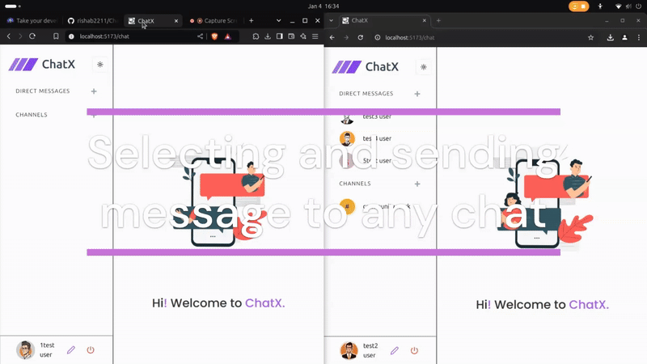

# ChatX - Realtime Chat Application 💬

[](https://opensource.org/licenses/MIT) **ChatX** is a feature-rich, real-time chat application built with modern web technologies. It allows users to connect via direct messages and group channels, share files, and customize their experience.

**🚀 Live Demo:** [**Try ChatX Now!**](https://chatx-snowy.vercel.app/)

---

## ✨ Features

* **🔐 Secure Authentication:** User registration and login using email and password.
* **👤 Profile Management:** Customize your profile with personal information and a profile picture.
* **🔍 User Discovery:** Easily search for and find other registered users.
* **✉️ Direct Messaging (DM):**
    * Initiate one-on-one conversations.
    * Maintain a contact list of users you've chatted with.
    * Real-time updates: DMs with new messages automatically move to the top of your list.
* **📢 Channels:**
    * Create public or private channels.
    * Invite contacts to join your channels.
    * Browse and participate in channels you are a member of.
    * Real-time updates: Channels with new activity rise to the top.
* **💬 Rich Messaging:**
    * Send and receive text messages instantly.
    * Share images and files within DMs and channels.
* **📜 Persistent Chat History:** Access previous messages when reopening a chat or channel.
* **🎨 Theme Customization:** Choose between Light, Dark, or System default themes for personalized viewing comfort.

---

## 🖼️ Demo / Screenshots



---

## 🛠️ Tech Stack

* **Frontend:**
    * **React:** Core UI library.
    * **Tailwind CSS:** Utility-first CSS framework for styling.
    * **Shadcn UI:** Reusable and accessible UI components.
    * **Zustand:** Minimalist global state management.
* **Backend:**
    * **Node.js:** JavaScript runtime environment.
    * **Express.js:** Web application framework for Node.js.
    * **Socket.IO:** (Or specify if using native WebSockets) For enabling real-time, bidirectional communication.
* **Database:**
    * **MongoDB:** NoSQL database for storing user data, messages, and channel information.
    * **Mongoose:** Object Data Modeling (ODM) library for MongoDB and Node.js.

---

## 🚀 Getting Started

Follow these instructions to set up the project locally for development or testing.

### Prerequisites

* **Node.js:** v18.x or later ([Download](https://nodejs.org/))
* **npm, yarn, or pnpm:** Package manager (npm comes with Node.js)
* **MongoDB:** A running MongoDB instance (local or cloud-based like MongoDB Atlas). Get the connection URI.
* **Git:** ([Download](https://git-scm.com/))

### Installation & Setup

1.  **Clone the repository:**
    ```bash
    git clone [https://github.com/rishab2211/ChatX.git](https://github.com/rishab2211/ChatX.git) 
    cd chatx-repo
    ```

2.  **Install Backend Dependencies:**
    ```bash
    # Navigate to backend directory (adjust if monorepo structure differs)
    cd server 
    npm install
    # or yarn install / pnpm install
    ```

3.  **Install Frontend Dependencies:**
    ```bash
    # Navigate to frontend directory (adjust if monorepo structure differs)
    cd ../client
    npm install
    # or yarn install / pnpm install
    cd ..
    ```

4.  **Set up Environment Variables:**
    * Create a `.env` file in your `server` (backend) directory.
    * Copy the contents of `.env.example` (if provided) or add the necessary variables:
        ```dotenv
        PORT=5000 # Or any port you prefer for the backend
        MONGODB_URI=your_mongodb_connection_string
        JWT_SECRET=your_very_strong_jwt_secret_key
        # Add any other required variables (e.g., Cloudinary keys for file uploads)
        ```
    * 

5.  **Run the Backend Server:**
    ```bash
    cd server
    npm run dev
    ```

6.  **Run the Frontend Application:**
    ```bash
    cd ../client
    npm run dev
    ```

7.  **Access the Application:** Open your browser and navigate to the frontend URL (usually `http://localhost:3000` or `http://localhost:5173` for Vite/React).

---

## 📖 Usage

1.  Register a new account or log in with existing credentials.
2.  Update your profile information and picture via the settings/profile section.
3.  Use the search bar to find other users.
4.  Click on a user to start a direct message conversation.
5.  Create new channels and add members from your contact list.
6.  Join existing channels you are invited to.
7.  Send text messages, emojis, images, or files in chats and channels.
8.  Switch between Light/Dark/System themes in the settings.