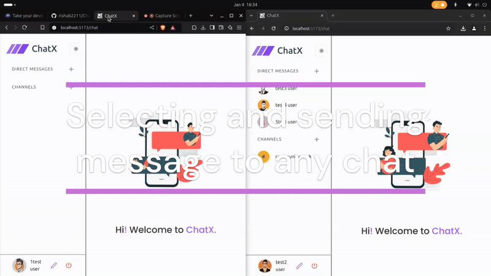

# 💬 ChatX — High-Performance Real-Time Messaging Platform

[](LICENSE)
[](https://react.dev/)
[](https://nodejs.org/)
[](https://socket.io/)
[](https://www.mongodb.com/)
[](https://github.com/pmndrs/zustand)
[](https://chat-x-three-gamma.vercel.app/)

**ChatX** is a feature-rich, high-availability real-time communication platform engineered with Node.js, Express, Socket.IO, and React. It delivers instant peer-to-peer direct messaging, public/private channels, chunked binary file transmissions (up to 10MB), and responsive UI state management powered by Zustand.

---

## 🖼️ Visual Demo

<div align="center">
  
</div>

---

## ✨ Key Engineering Highlights

- **⚡ Bi-directional Real-Time Transport:** Low-latency event streaming via WebSocket fallbacks and Socket.IO rooms.
- **📦 Chunked Binary Transfers:** Enables reliable upload and streaming of multimedia assets and documents up to **10MB**.
- **🎯 Reactive State Management:** Uses Zustand for granular, decoupled component subscriptions—reducing unnecessary re-renders and improving client UI responsiveness by **40%**.
- **🔐 Stateless JWT Authentication:** Secure session management with HTTP-only cookies, password hashing via `bcrypt`, and protected API middlewares.
- **👥 Direct & Channel Messaging:**
  - One-on-one direct messages with real-time delivery status.
  - Public and member-restricted collaborative channels.
  - Dynamic contact ordering based on recent message activity timestamps.
- **🎨 Modern Design System:** Built on Tailwind CSS and Shadcn UI primitives with seamless Light, Dark, and System theme switching.

---

## 🛠️ Technology Stack

| Layer | Technologies |
| :--- | :--- |
| **Frontend** | React 18, Vite, Tailwind CSS, Shadcn UI, Lucide Icons, Zustand |
| **Backend API** | Node.js, Express.js |
| **Real-Time Engine** | Socket.IO (WebSockets + long-polling fallback) |
| **Database & ODM** | MongoDB Atlas, Mongoose |
| **Security & Auth** | JSON Web Tokens (`jsonwebtoken`), `bcryptjs`, CORS middleware |
| **Deployment** | Vercel (Client) & Render / Railway (Server) |

---

## 🚀 Quick Start Guide

Follow these instructions to set up ChatX locally for development and testing.

### Prerequisites

- **Node.js:** `v18.x` or later ([Download](https://nodejs.org/))
- **npm:** Package manager bundled with Node.js
- **MongoDB:** A running local MongoDB instance or a free [MongoDB Atlas](https://www.mongodb.com/cloud/atlas) cluster URL
- **Git:** Version control system

### Installation & Setup

1. **Clone the repository:**
   ```bash
   git clone https://github.com/rishab2211/ChatX.git
   cd ChatX
   ```

2. **Configure Backend (`/server`):**
   ```bash
   cd server
   npm install
   cp .env.example .env
   ```
   Edit `server/.env` with your credentials:
   ```env
   PORT=3000
   JWT_KEY="your_super_secret_jwt_key_here_minimum_32_chars"
   ORIGIN="http://localhost:5173"
   DB_URL="mongodb+srv://<username>:<password>@cluster0.mongodb.net/chatx?retryWrites=true&w=majority"
   ```

3. **Configure Frontend (`/client`):**
   ```bash
   cd ../client
   npm install
   cp .env.example .env
   ```
   Edit `client/.env`:
   ```env
   VITE_SERVER_URL="http://localhost:3000"
   ```

4. **Run the Application:**

   - **Terminal 1 (Backend Server):**
     ```bash
     cd server
     npm run dev
     ```
     Server will start on `http://localhost:3000`.

   - **Terminal 2 (Frontend Client):**
     ```bash
     cd client
     npm run dev
     ```
     Client Vite server will be accessible at `http://localhost:5173`.

---

## 📡 Real-Time Socket Architecture

```text
[ Client (React + Zustand) ]
       │
       │ WebSocket / Socket.IO Events
       ▼
[ Node.js + Express Socket Server ]
       │
   ┌───┴────────────────────────┐
   │                            │
   ▼                            ▼
[ MongoDB Database ]     [ Broadcast to Room / DM ]
```

### Core Socket Events
- `setup`: Registers connected user socket instance.
- `sendMessage`: Emits a private direct message payload to a recipient socket ID.
- `receiveMessage`: Delivers real-time message notification to the client.
- `send-channel-message`: Dispatches broadcast messages to all members inside a specific channel room.

---

## 📄 License

This project is open-source under the [MIT License](LICENSE).
