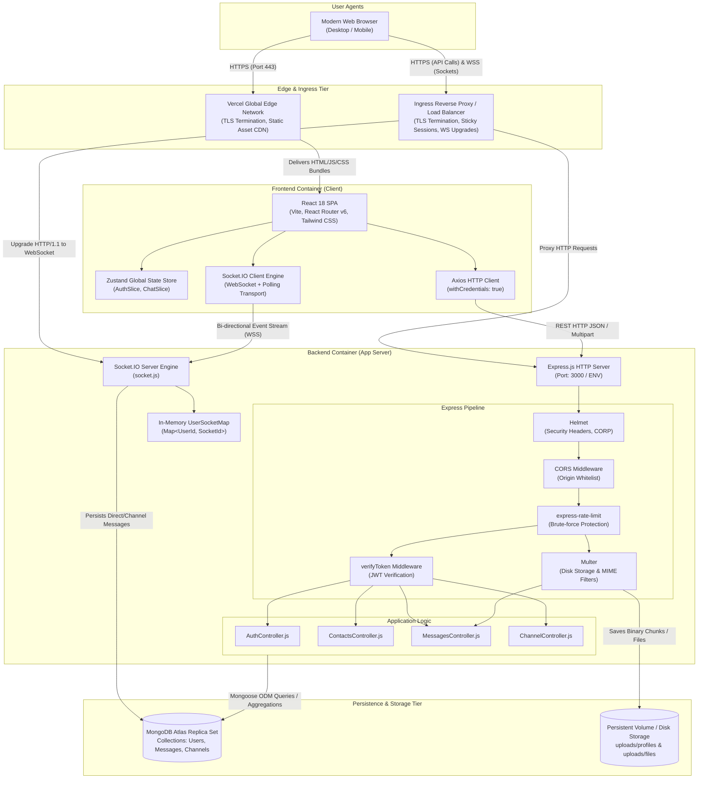
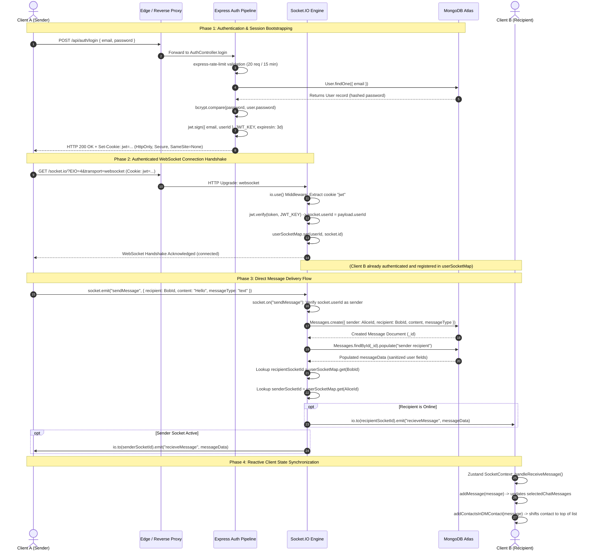

# System Boundaries & Request Lifecycle

## 1. System Architecture Overview

ChatX is a high-availability, full-duplex real-time communication platform built on a decoupled client-server architecture. The system decouples high-frequency bidirectional event transport (WebSockets via Socket.IO) from transactional RESTful business logic (Express.js), backed by MongoDB Atlas for document persistence and local or object storage for multimedia assets.

The runtime consists of:
- **Client Tier**: Single Page Application (SPA) built with React 18, Vite, Tailwind CSS, Shadcn UI primitives, and Zustand for state orchestration.
- **Edge / Delivery Tier**: Vercel Global Edge Network handling SSL/TLS termination, HTTP/2 static bundle caching, and SPA client-side route rewrites.
- **Application Server Tier**: Node.js v18+ runtime executing an Express.js HTTP application server co-hosted with a Socket.IO WebSocket server.
- **Data & Storage Tier**: MongoDB Atlas multi-node replica set with Mongoose ODM, alongside a hierarchical filesystem storage layer for binary message attachments and user avatars.

---

## 2. C4 Container Diagram

The following C4 container diagram illustrates the architectural boundaries, execution contexts, protocols, and data flow between external actors and internal system components.

---

## 3. End-to-End Request Lifecycle & User Flows

### Primary Flow: Authentication, WebSocket Handshake, and Real-Time Direct Message Dispatch

The sequence diagram below traces the end-to-end lifecycle across security middleware, cryptographic operations, state mutations, and real-time event broadcasting.

---

## 4. State Boundary Matrix

ChatX distributes state across four distinct tiers to balance operational latency, computational overhead, and durability.

| Dimension | Client Memory | Server Session | Cache (In-Memory App State) | Persistent Database |
| :--- | :--- | :--- | :--- | :--- |
| **Component** | Zustand Store (`useAppStore`) | Stateless JWT Cookie | `userSocketMap` (`Map<string, string>`) | MongoDB Atlas Collections (`Users`, `Messages`, `Channels`) |
| **Source of Truth** | Ephemeral UI Projection | Cryptographic Token (`jsonwebtoken`) | Node.js Process Memory | Primary Persistent Record |
| **Entities Stored** | `userInfo`, `selectedChatType`, `selectedChatData`, `selectedChatMessages`, `directMessagesContacts`, `channels` | `userId`, `email`, `iat`, `exp` | Active `userId` to `socket.id` mappings | User profiles, BCrypt password hashes, text & file messages, channel memberships |
| **Lifespan / TTL** | Browser Tab lifecycle (in-memory) | 3 Days (`maxAge = 259,200,000 ms`) | Connection lifecycle (destroyed on socket `disconnect`) | Indefinite / Immutable audit trail |
| **Serialization** | Plain JavaScript Objects / Proxy | Signed Compact JWT string (`HS256`) | V8 Heap Hash Map | BSON Documents |
| **Failure Impact** | UI reset; user prompted to reload or re-fetch `/user-info` | Request fails with `401 Unauthorized`; client redirects to `/auth` | Direct messages fall back to DB-only; real-time push fails until client reconnects | Complete outage for API and historical retrieval; real-time socket delivery halts |
| **Sync Mechanism** | Updated via Axios REST responses and Socket.IO incoming events (`recieveMessage`, `recieve-channel-message`) | Injected by client on every HTTP request and WebSocket upgrade header | Synchronized on Socket.IO `connection` and `disconnect` events | Written via Mongoose models (`create`, `findByIdAndUpdate`, `aggregate`) |

---

## 5. Security Perimeter

ChatX enforces defense-in-depth across multiple application boundaries:

```mermaid
graph LR
    subgraph External ["Untrusted Outer Boundary"]
        PublicReq["Public Client Request"]
    end

    subgraph EdgeSec ["Perimeter 1: Transport & Network"]
        TLS["TLS 1.3 Termination<br/>(HTTPS / WSS)"]
        CORS["Strict CORS Filtering<br/>Origin: process.env.ORIGIN<br/>Credentials: true"]
    end

    subgraph AppSec ["Perimeter 2: Application Shields"]
        HelmetH["Helmet HTTP Headers<br/>(CORP: cross-origin)"]
        RL["express-rate-limit<br/>Auth: 20 req/15m<br/>Search: 30 req/1m"]
        SizeLimit["Body Parser Cap<br/>JSON / URL-encoded: 1MB"]
    end

    subgraph AuthSec ["Perimeter 3: Identity & Integrity"]
        JWTCookie["HttpOnly, Secure, SameSite=None<br/>JWT Cookie Verification"]
        SocketAuth["Socket.IO Handshake Auth Guard"]
        UploadSanitize["Multer MIME Type White-listing<br/>Disk Path Sanitization"]
        RegexEsc["Regex Sanitization<br/>(Contacts Search ReDoS Shield)"]
    end

    subgraph CoreDomain ["Protected Domain Core"]
        Handlers["Controller Business Logic & DB Operations"]
    end

    PublicReq --> TLS --> CORS --> HelmetH --> RL --> SizeLimit --> JWTCookie --> SocketAuth --> UploadSanitize --> RegexEsc --> Handlers
```

### 1. Transport Layer Security (TLS/WSS) & CORS Whitelisting
- All traffic in transit is encrypted using TLS 1.3 at the edge (Vercel and Render/Railway load balancers).
- Cross-Origin Resource Sharing (CORS) is explicitly constrained in [server/index.js](file:///home/rishab/Personal/WebDev/ChatX/server/index.js#L47-L53) to `process.env.ORIGIN` (`http://localhost:5173` in local development or the production Vercel domain).
- Express explicitly rejects unauthorized cross-origin preflight requests while permitting `GET, POST, PUT, PATCH, DELETE` verbs with `credentials: true`.

### 2. Rate Limiting & Denial-of-Service (DoS) Protection
- **Authentication Routes**: Protected by `authLimiter` allowing a maximum of 20 requests per 15-minute sliding window on `/api/auth/login` and `/api/auth/signup` to prevent password brute-forcing and credential stuffing.
- **Search Queries**: Protected by `searchLimiter` capping requests to 30 per minute on `/api/contacts/search` to protect MongoDB from resource exhaustion during user lookup.
- **Payload Caps**: Body parser explicitly limits incoming JSON and URL-encoded bodies to `1MB` ([server/index.js](file:///home/rishab/Personal/WebDev/ChatX/server/index.js#L37-L38)).

### 3. Stateless Cryptographic Session Management
- Sessions rely on JSON Web Tokens signed with HMAC-SHA256 (`HS256`) using `process.env.JWT_KEY`.
- Tokens are delivered exclusively via `Set-Cookie` with the following flags:
  - `httpOnly: true`: Prevents client-side scripts from reading the token via `document.cookie`, mitigating XSS credential theft.
  - `secure: true`: Mandates that cookies are only transmitted over HTTPS connections.
  - `sameSite: "None"`: Allows credentialed cross-origin requests between the distinct client domain (Vercel) and API server (Render/Railway).
  - `maxAge: 3 * 24 * 60 * 60 * 1000` (72 hours).

### 4. Auth Context Injection & Socket Authentication
- **REST Middleware**: [AuthMiddleware.js](file:///home/rishab/Personal/WebDev/ChatX/server/middlewares/AuthMiddleware.js#L3-L16) extracts `req.cookies.jwt`. If valid, it verifies the signature and injects `req.userId` directly into the request lifecycle. If missing or invalid, it returns `401 Unauthorized` or `403 Forbidden`.
- **WebSocket Middleware**: [socket.js](file:///home/rishab/Personal/WebDev/ChatX/server/socket.js#L18-L38) executes an `io.use()` handshake interceptor. It parses incoming cookie headers from the raw WebSocket HTTP upgrade request, verifies the token with `jwt.verify`, and binds `socket.userId`. Sockets lacking a valid token are rejected before establishing a connection.
- **Sender Verification**: Incoming socket message events ([socket.js](file:///home/rishab/Personal/WebDev/ChatX/server/socket.js#L170-L174)) enforce the authenticated user's ID as the sender (`{ ...message, sender: socket.userId }`), preventing sender spoofing.

### 5. Input Sanitization & Upload Boundaries
- **Regex Injection Prevention**: User input in [ContactsController.js](file:///home/rishab/Personal/WebDev/ChatX/server/controllers/ContactsController.js#L22) undergoes strict regex escaping (`searchTerm.replace(/[.*+?^${}()|[\]\\]/g, "\\$&")`) before evaluation in MongoDB queries, neutralizing ReDoS (Regular Expression Denial of Service).
- **File Upload Restrictions**:
  - Profile Avatars: Multer restricts uploads to 5MB and validates MIME types to `['image/jpeg', 'image/png', 'image/webp', 'image/gif', 'image/svg+xml']` ([server/routes/AuthRoutes.js](file:///home/rishab/Personal/WebDev/ChatX/server/routes/AuthRoutes.js#L10-L17)).
  - Chat Attachments: Multer caps uploads to 10MB and validates MIME types to safe image, document, text, and archive formats ([server/routes/MessagesRoute.js](file:///home/rishab/Personal/WebDev/ChatX/server/routes/MessagesRoute.js#L6-L18)).
