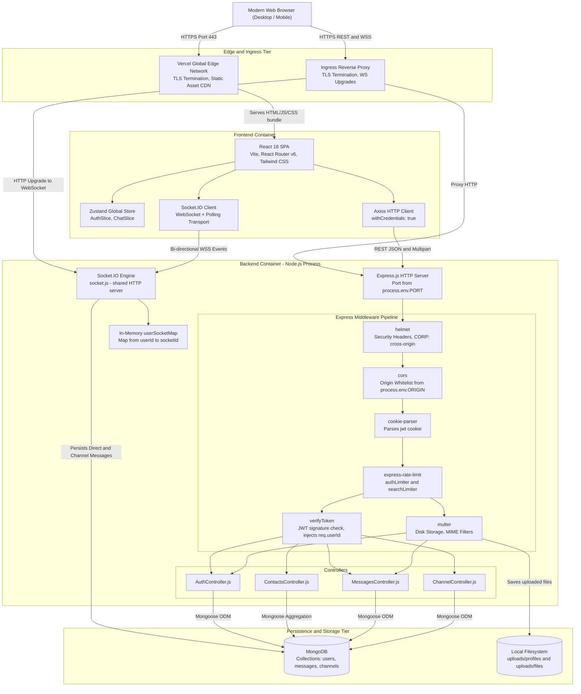
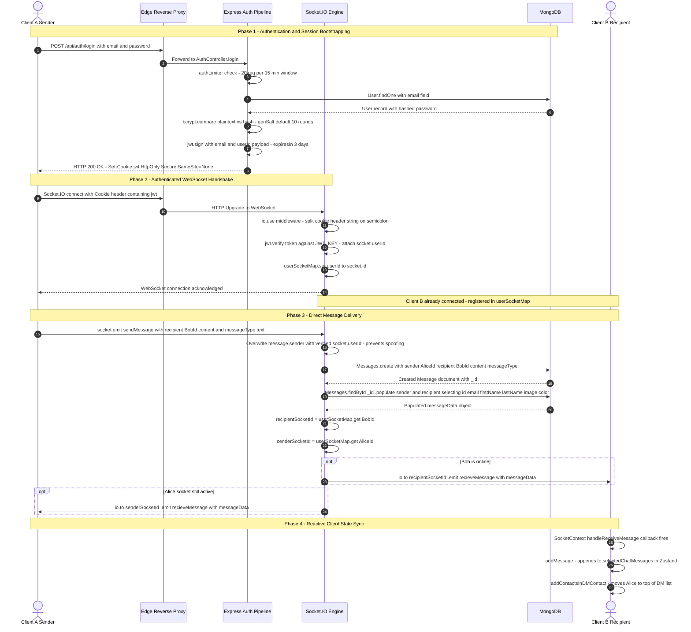

# System Boundaries & Request Lifecycle

## 1. System Architecture Overview

ChatX is a high-availability, full-duplex real-time communication platform built on a decoupled client-server architecture. The system decouples high-frequency bidirectional event transport (WebSockets via Socket.IO) from transactional RESTful business logic (Express.js), backed by MongoDB Atlas for document persistence and local filesystem storage for multimedia assets.

The runtime consists of:
- **Client Tier**: Single Page Application (SPA) built with React 18, Vite, Tailwind CSS, Shadcn UI primitives, and Zustand for state orchestration.
- **Edge / Delivery Tier**: Vercel Global Edge Network handling TLS termination, HTTP/2 static bundle caching, and SPA client-side route rewrites (`vercel.json`).
- **Application Server Tier**: Node.js v18+ runtime executing an Express.js HTTP application server co-hosted with a Socket.IO WebSocket server on the **same TCP port**.
- **Data & Storage Tier**: MongoDB Atlas (or local `mongod`) with Mongoose ODM, alongside a local filesystem storage layer (`uploads/profiles`, `uploads/files`) for binary message attachments and user avatars.

---

## 2. C4 Container Diagram

The following C4 container diagram illustrates the architectural boundaries, execution contexts, protocols, and data flow between external actors and internal system components.

---

## 3. End-to-End Request Lifecycle & User Flows

### Primary Flow: Authentication, WebSocket Handshake, and Real-Time Direct Message Dispatch

The sequence diagram below traces the end-to-end lifecycle across security middleware, cryptographic operations, state mutations, and real-time event broadcasting.

---

## 4. State Boundary Matrix

ChatX distributes state across four distinct tiers to balance operational latency, computational overhead, and durability.

| Dimension | Client Memory | Server Session | In-Process Cache | Persistent Database |
| :--- | :--- | :--- | :--- | :--- |
| **Component** | Zustand `useAppStore` | Stateless JWT Cookie (`jwt`) | `userSocketMap` (`Map<string, string>`) | MongoDB collections `users`, `messages`, `channels` |
| **Source of Truth** | Ephemeral UI projection | Cryptographic token signed with `JWT_KEY` | Node.js V8 heap — single process only | Authoritative persistent record |
| **Entities Stored** | `userInfo`, `selectedChatType`, `selectedChatData`, `selectedChatMessages`, `directMessagesContacts`, `channels` | `{ userId, email, iat, exp }` | Live `userId → socket.id` mappings for connected users | User profiles, bcrypt password hashes, text and file messages, channel memberships and message ID arrays |
| **Lifespan / TTL** | Browser tab session (in-memory, not persisted) | 72 hours (`maxAge = 3 * 24 * 60 * 60 * 1000 = 259,200,000 ms`) | Socket connection lifecycle — entry on `connection`, deletion on `disconnect` | Indefinite (no TTL configured on any collection) |
| **Serialization** | Plain JS objects via Zustand Proxy | HS256-signed compact JWT string | V8 Map in heap memory | BSON documents |
| **Failure Impact** | UI resets; App.jsx re-fetches `GET /api/auth/user-info` on reload | Returns 401; client `PrivateRoute` redirects to `/auth` | Real-time push breaks — message is still persisted to DB but not delivered until client reconnects | Complete API and history outage; socket message creation also fails |
| **Sync Mechanism** | Updated by Axios responses and Socket.IO events `recieveMessage` and `recieve-channel-message` | Injected automatically by browser on every HTTP request and WebSocket upgrade via Cookie header | Set on `io.on("connection")`, deleted in `disconnect` handler | Written via Mongoose `create`, `findByIdAndUpdate`, `$push` aggregation |

---

## 5. Security Perimeter

ChatX enforces defense-in-depth across multiple application boundaries:

```mermaid
graph LR
    PublicReq["Public Client Request"]

    subgraph Perimeter1 ["Perimeter 1 - Transport and Network"]
        TLS["TLS Termination\nHTTPS and WSS at edge"]
        CORS["CORS Filtering\nOrigin locked to process.env.ORIGIN\ncredentials: true"]
    end

    subgraph Perimeter2 ["Perimeter 2 - Application Shields"]
        HelmetH["helmet\nSecurity Headers\nCORP: cross-origin"]
        RL["express-rate-limit\nauthLimiter: 20 req per 15 min\nsearchLimiter: 30 req per 1 min"]
        SizeLimit["Body Parser Cap\nJSON and URL-encoded: 1MB"]
    end

    subgraph Perimeter3 ["Perimeter 3 - Identity and Integrity"]
        JWTCookie["JWT Cookie Verification\nhttpOnly Secure SameSite=None\nverifyToken middleware"]
        SocketAuth["Socket.IO io.use Guard\nCookie header parsed manually\njwt.verify on handshake"]
        UploadSanitize["Multer MIME Allowlist\nProfile: 5MB JPEG PNG WebP GIF SVG\nFiles: 10MB images docs archives"]
        RegexEsc["Regex Sanitization\nReDoS shield in searchContacts\nreplace special chars before RegExp"]
    end

    subgraph Core ["Protected Domain Core"]
        Handlers["Controller Business Logic\nMongoose DB Operations"]
    end

    PublicReq --> TLS --> CORS --> HelmetH --> RL --> SizeLimit --> JWTCookie --> SocketAuth --> UploadSanitize --> RegexEsc --> Handlers
```

### 1. Transport Layer Security & CORS Whitelisting
- All traffic in transit is TLS-terminated at the edge (Vercel for the SPA, Render/Railway for the API).
- CORS is explicitly constrained in [server/index.js L47–53](../server/index.js#L47-L53) to a single allowed origin (`process.env.ORIGIN`), with `credentials: true` and methods `GET, POST, PUT, PATCH, DELETE`.

### 2. Rate Limiting & DoS Protection
- **`authLimiter`**: Max 20 requests per 15-minute window applied to `/api/auth/login` and `/api/auth/signup` ([server/index.js L65–69, 83–84](../server/index.js#L65-L84)).
- **`searchLimiter`**: Max 30 requests per 1-minute window on `/api/contacts/search` ([server/index.js L71–75, 85](../server/index.js#L71-L85)).
- **Body cap**: `express.json({ limit: "1mb" })` and `express.urlencoded({ limit: "1mb" })` ([server/index.js L37–38](../server/index.js#L37-L38)).

### 3. Stateless JWT Session Management
- Tokens are signed with HS256 using `process.env.JWT_KEY`. Payload: `{ email, userId }`.
- Delivered as `Set-Cookie: jwt=...; HttpOnly; Secure; SameSite=None; Max-Age=259200`.
- `httpOnly: true` prevents XSS token theft. `secure: true` blocks plaintext transmission. `sameSite: "None"` is required for cross-domain cookie transmission (Vercel ↔ Render).

### 4. Auth Context Injection & Socket Authentication
- **REST**: [`verifyToken`](../server/middlewares/AuthMiddleware.js#L3-L16) reads `req.cookies.jwt`, calls `jwt.verify`, and injects `req.userId`. Returns `401` if cookie absent, `403` if token invalid.
- **WebSocket**: [`io.use()` in socket.js L18–38](../server/socket.js#L18-L38) manually splits `socket.handshake.headers.cookie` to extract the `jwt=` value, verifies it, and sets `socket.userId`. Connection is rejected pre-handshake if verification fails.
- **Sender enforcement**: All `sendMessage` and `send-channel-message` handlers overwrite the `sender` field with `socket.userId` ([server/socket.js L170–174](../server/socket.js#L170-L174)), preventing client-side sender spoofing.

### 5. Input Sanitization & Upload Boundaries
- **ReDoS prevention**: `searchTerm` is escaped with `replace(/[.*+?^${}()|[\]\\]/g, "\\$&")` before constructing a `RegExp` ([server/controllers/ContactsController.js L22](../server/controllers/ContactsController.js#L22)).
- **Profile avatars**: Multer allows `['image/jpeg','image/png','image/webp','image/gif','image/svg+xml']`, max 5 MB ([server/routes/AuthRoutes.js L21–25](../server/routes/AuthRoutes.js#L21-L25)).
- **Chat file attachments**: Multer allows images, PDF, DOC/DOCX, TXT, ZIP, RAR; max 10 MB ([server/routes/MessagesRoute.js L20–25](../server/routes/MessagesRoute.js#L20-L25)).
