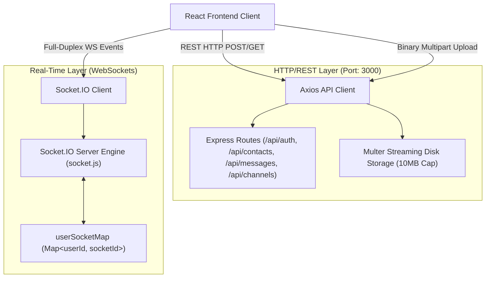

# Architectural Decision Records (ADRs)

This document records the foundational architectural decisions governing ChatX, detailing technical drivers, evaluated alternatives, selected strategies, and system trade-offs.

---

## ADR-001: Database Selection — Document NoSQL (MongoDB + Mongoose) vs. Relational SQL

### Status
Accepted

### Context & Problem Statement
ChatX is a real-time messaging application supporting polymorphic message structures (plain text, formatted content, multimedia files with metadata), dynamic collaborative channels with variable member counts, and high write volumes for message ingestion. The persistence layer must support:
1. High-throughput writes for one-to-one direct messages and multi-recipient channel broadcasts.
2. Flexible message schemas that accommodate text bodies, file URLs, audio/video binary metadata, and read receipts without requiring schema-altering table migrations.
3. Rapid prototype iterations and dynamic document joins for user presence and contact ordering.

### Decision
Adopt **MongoDB Atlas** with **Mongoose ODM (v8.7.3)** as the primary persistence engine.

Entities are partitioned into three core collections:
- `Users`: Profile metadata, credentials, and configuration flags ([UserModel.js](file:///home/rishab/Personal/WebDev/ChatX/server/models/UserModel.js)).
- `Messages`: Immutable message records containing sender/recipient references, message types (`text` vs. `file`), text payloads, and file URLs ([MessagesModel.js](file:///home/rishab/Personal/WebDev/ChatX/server/models/MessagesModel.js)).
- `Channels`: Group conversations referencing an array of member `ObjectId`s, an admin `ObjectId`, and a historical array of message `ObjectId`s ([ChannelModel.js](file:///home/rishab/Personal/WebDev/ChatX/server/models/ChannelModel.js)).

### Options Considered
1. **MongoDB Atlas (Document NoSQL)**: Selected.
2. **PostgreSQL (Relational SQL with JSONB)**: Relational schema with foreign keys, strict joins, and JSONB columns for flexible message metadata.
3. **MySQL (Relational SQL)**: Traditional relational normalization with separate join tables (`channel_members`, `channel_messages`).

### Pros & Cons Analysis

| Dimension | MongoDB + Mongoose (Chosen) | PostgreSQL | MySQL |
| :--- | :--- | :--- | :--- |
| **Write Throughput** | High: Unconstrained append-only writes via WiredTiger engine without foreign key constraint checks. | High: ACID-compliant writes with WAL (Write-Ahead Logging); slight overhead on index updates and foreign key cascades. | Medium: InnoDB row-level locking overhead under high write contention. |
| **Schema Polymorphism** | Native: Documents naturally support conditional fields (`content` required only for `messageType === "text"`, `fileUrl` for `messageType === "file"`). | Hybrid: Requires JSONB columns for non-standard message attributes or multiple nullable columns. | Low: Rigid relational column schemas requiring explicit schema alterations. |
| **Relational Queries** | Requires Aggregation Pipelines (`$lookup`, `$unwind`, `$group`) or Mongoose `.populate()`. | Exceptional: Native SQL joins with cost-based query optimizer and composite index support. | Good: Native relational joins. |
| **Horizontal Scalability** | Native sharding out-of-the-box (sharding on `_id` or `channelId`). | Complex: Requires partitioning extensions (Citus) or read-replica connection pools. | Complex: Requires manual sharding or read replica management. |

### Trade-offs & Consequences
- **Unbounded Document Growth**: Embedding message references in `Channels.messages` creates risk of exceeding the 16MB BSON document size limit if a channel accumulates hundreds of thousands of messages.
  - *Mitigation Plan*: In Sprint 3 of the scale roadmap, deprecate the embedded `messages` array in `Channels` and pivot to a parent-reference pattern where messages store `channelId: ObjectId` with a compound index `{ channelId: 1, timestamp: -1 }`.
- **Lack of Multi-Document Foreign Key Cascading**: Deleting a user does not automatically purge their messages in MongoDB. The application server must handle orphaned document lifecycle management.
- **Aggregation Complexity**: Calculating the recent contacts list for direct messaging requires a multi-stage aggregation pipeline ([ContactsController.js](file:///home/rishab/Personal/WebDev/ChatX/server/controllers/ContactsController.js#L67-L116)) utilizing `$match`, `$sort`, `$group`, `$lookup`, `$unwind`, and `$project`.

---

## ADR-002: API Protocol & Data Exchange — Hybrid REST + Socket.IO WebSockets

### Status
Accepted

### Context & Problem Statement
ChatX requires two fundamentally divergent communication paradigms:
1. **Transactional Request-Response**: User onboarding (signup/login), profile configuration, avatar uploads, chunked binary file transfers up to 10MB, and contact directory browsing.
2. **Sub-100ms Duplex Streaming**: Bidirectional message dispatch, typing indicators, user online/offline presence synchronization, and instantaneous notification fan-out.

Single-protocol architectures either incur polling overhead (pure REST) or struggle with multipart binary streams and cacheable metadata delivery (pure WebSockets).

### Decision
Implement a **Dual-Protocol Hybrid Architecture**:
- **RESTful HTTP (Express.js 4.21)**: Handles authentication, user search, profile modifications, historical message retrieval, and multipart file uploads using `multer`.
- **Socket.IO (v4.8.1) over WebSockets with Polling Fallback**: Handles real-time direct messaging (`sendMessage`), channel broadcasts (`send-channel-message`), and socket presence tracking.

### Options Considered
1. **Hybrid REST + Socket.IO**: Selected.
2. **Pure WebSockets (`ws` / native)**: Running all data transfer, including auth, file streaming, and pagination, over raw WebSocket frames.
3. **GraphQL with Subscriptions (Apollo Server)**: Single schema with HTTP queries/mutations and WebSocket subscriptions.
4. **tRPC with Server-Sent Events (SSE)**: Type-safe RPC with unidirectionally streamed server events.

### Pros & Cons Analysis

| Dimension | Hybrid REST + Socket.IO (Chosen) | Pure WebSockets | GraphQL + Subscriptions |
| :--- | :--- | :--- | :--- |
| **Binary File Transfers** | Standard: Leverages battle-tested HTTP multipart streaming (`multipart/form-data`) with progress reporting (`onUploadProgress`). | Complex: Requires custom chunk fragmentation, binary framing, and buffer reassembly at the application layer. | Poor: Multipart file uploads require non-standard GraphQL specifications (GraphQL-Multipart-Request-Spec). |
| **Transport Reliability** | High: Socket.IO provides automatic heartbeat/ping-pong, connection state recovery, and automatic HTTP long-polling fallback behind corporate firewalls. | Low: Native `ws` requires manual implementation of reconnection backoff, keep-alives, and room management. | Medium: Requires external pub/sub adapters and complex client subscription link management. |
| **Caching & Edge Routing** | High: REST endpoints can leverage standard HTTP caching, CDN edge caching, and standard reverse proxy rate limiters. | None: Persistent TCP socket bypasses standard HTTP caching mechanisms. | Low: POST-based queries bypass edge CDNs without specialized persisted query configurations. |
| **Protocol Overhead** | Low: Small JSON event payloads over persistent TCP connection for chat; zero HTTP handshake overhead during active messaging. | Minimal: Pure WS has slightly lower frame overhead than Socket.IO packet wrappers. | High: Verbose JSON request schemas and AST parsing overhead on every operation. |

### Trade-offs & Consequences
- **Split Authentication Boundary**: Authentication must be verified twice: first in Express middleware via [AuthMiddleware.js](file:///home/rishab/Personal/WebDev/ChatX/server/middlewares/AuthMiddleware.js) for REST calls, and second during the Socket.IO HTTP upgrade handshake via `io.use()` in [socket.js](file:///home/rishab/Personal/WebDev/ChatX/server/socket.js#L18-L38).
- **Client Coordination**: Frontend components must coordinate REST queries (e.g., fetching initial message history via `POST /api/messages/get-messages`) with live Socket listeners (`recieveMessage`) to prevent duplicate rendering or out-of-order message displays.

---

## ADR-003: Authentication & State Strategy — Stateless JWT in HTTP-Only Cookies vs. Stateful Sessions

### Status
Accepted

### Context & Problem Statement
ChatX is deployed across distinct domains in production:
- Client: `https://chat-x-three-gamma.vercel.app` (Vercel)
- Server: `https://chatx-backend.onrender.com` (Render/Railway)

The authentication mechanism must satisfy three non-negotiable requirements:
1. Immunity to Cross-Site Scripting (XSS) credential theft.
2. Complete interoperability across HTTP REST requests and the initial WebSocket HTTP upgrade handshake.
3. Zero centralized session storage latency on the server, ensuring that API routing remains horizontal-ready.

### Decision
Implement **Stateless JSON Web Tokens (JWT)** stored in **HTTP-Only, Secure, SameSite=None Cookies**.

Key parameters:
- Algorithm: HMAC-SHA256 (`HS256`) signed with `process.env.JWT_KEY`.
- Token Payload: `{ email: user.email, userId: user.id }`.
- Lifetime: 72 hours (`maxAge: 3 * 24 * 60 * 60 * 1000`).
- Cookie Attributes:
  - `httpOnly: true`: Blocks client-side JavaScript access via `document.cookie`.
  - `secure: true`: Mandates transport exclusively over HTTPS.
  - `sameSite: "None"`: Permits cross-site cookie transmission between the Vercel frontend domain and Render backend domain.

### Options Considered
1. **Stateless JWT in HTTP-Only Cookies**: Selected.
2. **Stateful Server-Side Sessions (Redis / MongoDB Session Store)**: Generating an opaque session ID stored in a cookie, pointing to a server-side session document.
3. **Bearer Token in LocalStorage / Authorization Header**: Storing the JWT inside browser `localStorage` or `sessionStorage` and transmitting it via `Authorization: Bearer <token>`.

### Pros & Cons Analysis

| Dimension | JWT in HTTP-Only Cookies (Chosen) | Stateful Redis Sessions | Bearer Token in LocalStorage |
| :--- | :--- | :--- | :--- |
| **XSS Vulnerability** | **Immune**: Malicious scripts injected via third-party libraries or unescaped HTML cannot access the cookie. | **Immune**: Session ID is shielded by `httpOnly: true`. | **Vulnerable**: Any client-side XSS vulnerability allows instantaneous extraction of user tokens. |
| **WebSocket Handshake Interoperability** | **Native**: The browser automatically transmits the `Cookie` header during the initial WebSocket HTTP upgrade handshake (`socket.handshake.headers.cookie`). | **Native**: Browser passes session cookie during WS handshake. | **Difficult**: Browser native `WebSocket` API does not permit custom headers (`Authorization: Bearer`), requiring token transmission in query params (exposing tokens in server access logs). |
| **Server Overhead** | **Zero**: Cryptographic verification (`jwt.verify`) occurs in-memory on the Node.js process without database lookups. | **High**: Requires a round-trip network hop to Redis/MongoDB for every HTTP request and socket event. | **Zero**: Cryptographic verification in-memory. |
| **Token Revocation** | **Delayed**: Token cannot be revoked before expiration without maintaining a distributed token blocklist in Redis. | **Immediate**: Deleting the session record in Redis instantly revokes user access across all nodes. | **Delayed**: Token cannot be revoked before expiration without a distributed blocklist. |

### Trade-offs & Consequences
- **CSRF Exposure**: Storing authentication in cookies introduces theoretical Cross-Site Request Forgery (CSRF) risk. This is mitigated by:
  1. Strict CORS origin whitelisting in Express ([server/index.js](file:///home/rishab/Personal/WebDev/ChatX/server/index.js#L47-L53)), rejecting unauthorized origins.
  2. Enforcing custom content-type headers (`application/json`) which trigger browser preflight `OPTIONS` checks that reject unauthorized cross-origin requests.
- **Revocation Lag**: In the event of account compromise, immediate session invalidation requires waiting for token expiry or adding a Redis-based revocation list in future scaling sprints.
