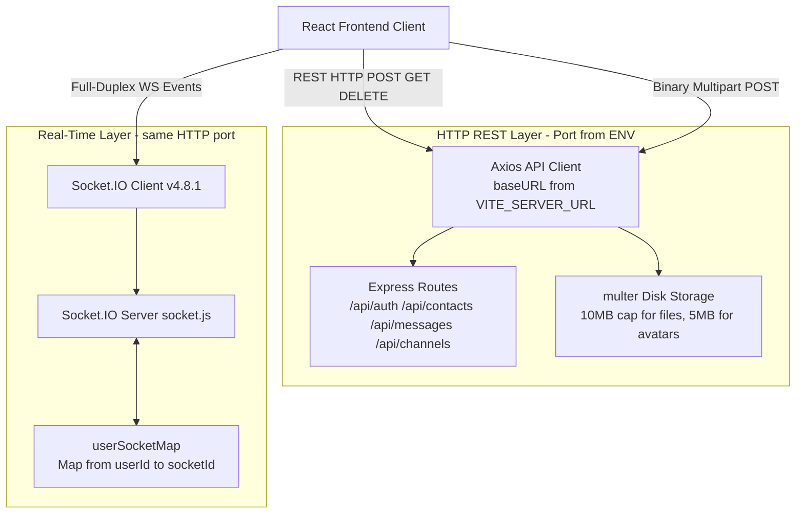

# Architectural Decision Records (ADRs)

This document records the foundational architectural decisions governing ChatX, detailing technical drivers, evaluated alternatives, selected strategies, and system trade-offs.

---

## ADR-001: Database Selection — Document NoSQL (MongoDB + Mongoose) vs. Relational SQL

### Status
Accepted

### Context & Problem Statement
ChatX requires persistence for three distinct entity shapes:
1. **Users**: Fixed-schema documents (email, hashed password, optional profile fields, a boolean flag).
2. **Messages**: Polymorphic documents — the `content` field is only required when `messageType === "text"` and `fileUrl` is only required when `messageType === "file"`. This conditional field requirement is implemented as a dynamic Mongoose validator (`required: function() { return this.messageType === "text"; }`), which maps awkwardly onto a fixed relational schema.
3. **Channels**: References an unbounded array of member `ObjectId`s and an ordered array of message `ObjectId`s, updated on every message send via `$push`. The append-only pattern on a document is a natural document-store operation.

The persistence layer must additionally support:
- High-throughput writes for one-to-one direct messages and channel broadcasts.
- A multi-stage aggregation for building the sorted DM contact list (see [`ContactsController.js`](../server/controllers/ContactsController.js#L67-L116)).
- Rapid development iteration without schema migration tooling.

### Decision
Adopt **MongoDB Atlas** with **Mongoose ODM (v8.7.3)** as the sole persistence engine.

Three collections are defined:
- `users` — mapped by `mongoose.model("Users", userSchema)` ([UserModel.js](../server/models/UserModel.js)).
- `messages` — mapped by `mongoose.model("Messages", messageSchema)` ([MessagesModel.js](../server/models/MessagesModel.js)).
- `channels` — mapped by `mongoose.model("Channels", channelSchema)` ([ChannelModel.js](../server/models/ChannelModel.js)).

### Options Considered
1. **MongoDB Atlas + Mongoose (Selected)**
2. **PostgreSQL with JSONB columns**
3. **MySQL (relational normalization)**

### Pros & Cons Analysis

| Dimension | MongoDB + Mongoose (Chosen) | PostgreSQL | MySQL |
| :--- | :--- | :--- | :--- |
| **Polymorphic Message Schema** | Native: `messageType` discriminator with Mongoose dynamic validators handles `text`/`file` conditional fields without schema alterations. | Requires either: a single wide table with many nullable columns, or a JSONB column losing type safety on `content`/`fileUrl`. | Requires an `ALTER TABLE` migration and application-level null handling to add new message types. |
| **Write Throughput** | High: WiredTiger engine with document-level locking; no foreign-key constraint checks on `$push`. | High but with overhead: WAL write, index update, and FK cascade on every insert. FK from `messages.sender_id → users.id` enforced at DB level. | Medium: InnoDB row-level locking under high concurrent inserts; FK cascade overhead. |
| **Contact Recency Aggregation** | Requires the 6-stage aggregation pipeline in `ContactsController.js` (`$match → $sort → $group → $lookup → $unwind → $project`). No native JOIN. | Single SQL query: `SELECT DISTINCT ON (other_party) ... ORDER BY timestamp DESC` with a partial index on `sender_id` or `recipient_id`. Simpler and faster with the right index. | Similar to PostgreSQL with `GROUP BY` but lacks `DISTINCT ON`; requires a subquery. |
| **Horizontal Scalability** | Native range/hash sharding on `_id` or `channelId` via Atlas. | Requires Citus extension or manual partitioning; single-writer primaries limit write scale. | Requires external proxy (ProxySQL) or manual sharding; no built-in horizontal scaling. |

### Trade-offs & Consequences
- **Unbounded `Channel.messages` Array**: Every channel message appends an `ObjectId` to `Channel.messages` via `Channel.findByIdAndUpdate(channelId, { $push: { messages: createdMessage._id } })` ([socket.js L123–127](../server/socket.js#L123-L127)). This will hit the 16MB BSON document ceiling in high-volume channels and degrades write performance due to document re-allocation.
  - *Mitigation*: Migrate to a parent-reference pattern: add `channelId: ObjectId` to the `Messages` schema and query by `{ channelId, timestamp }` with a compound index. Drop the embedded array entirely.
- **No Cascading Deletes**: MongoDB has no equivalent to `ON DELETE CASCADE`. Deleting a user orphans their messages in the `messages` collection. Application-level cleanup must be implemented explicitly.
- **Aggregation Brittleness**: The `$lookup` in `getContactsForDMList` joins `messages` to `users` using `from: "users"` — the lowercase plural collection name. This coupling to Mongoose's internal naming convention breaks silently if the model name changes.

---

## ADR-002: API Protocol & Data Exchange — Hybrid REST + Socket.IO WebSockets

### Status
Accepted

### Context & Problem Statement
ChatX requires two fundamentally divergent communication patterns:
1. **Transactional Request-Response**: User registration (`POST /api/auth/signup`), login (`POST /api/auth/login`), profile updates (`POST /api/auth/update-profile`), binary file uploads (`POST /api/messages/upload-file`, max 10MB via Multer), and historical message retrieval (`POST /api/messages/get-messages`).
2. **Persistent Bidirectional Push**: Real-time delivery of direct messages (`sendMessage` event) and channel messages (`send-channel-message` event) to connected sockets.

> **Important**: The current implementation does **not** include typing indicators, read receipts, or online presence broadcasts. These remain unimplemented and are not handled by any socket event in `socket.js`.

### Decision
Implement a **Dual-Protocol Hybrid Architecture**:
- **RESTful HTTP (Express.js 4.21)**: Authentication, user search, profile modifications, historical message retrieval, and multipart file uploads via `multer`.
- **Socket.IO v4.8.1 over WebSockets (with HTTP long-polling fallback)**: Real-time direct messaging (`sendMessage`) and channel broadcasts (`send-channel-message`).

### Options Considered
1. **Hybrid REST + Socket.IO** — Selected
2. **Pure WebSockets (`ws` / native)**
3. **GraphQL with Subscriptions (Apollo Server)**
4. **tRPC with Server-Sent Events (SSE)**

### Pros & Cons Analysis

| Dimension | Hybrid REST + Socket.IO (Chosen) | Pure WebSockets | GraphQL + Subscriptions |
| :--- | :--- | :--- | :--- |
| **Binary File Transfers** | Native HTTP multipart (`multipart/form-data`) with Multer progress via `onUploadProgress`. 10MB cap enforced at Multer layer, not socket layer. | Requires manual binary framing, chunking protocol, and client-side reassembly — no ecosystem equivalent to Multer. | Requires the GraphQL Multipart Request Spec (an unofficial extension); incompatible with standard Apollo Server without additional packages. |
| **Transport Reliability** | Socket.IO auto-reconnects, falls back to HTTP long-polling behind proxies that block WebSocket upgrades. The `io.use()` guard rejects unauthenticated reconnects on each attempt. | Raw `ws` has no built-in reconnection, room management, or polling fallback. All of these must be hand-rolled. | Apollo subscriptions over `graphql-ws` require separate WebSocket server setup and subscription-link negotiation; no automatic polling fallback. |
| **Historical Message Loading** | REST endpoint `POST /api/messages/get-messages` can be independently rate-limited, cached, and paginated. | Every historical load would require a request-response message frame over the socket — mixing transactional and streaming semantics on one channel. | REST-like queries are issued as GraphQL queries over HTTP; this works but requires schema definition overhead with no tangible benefit for this scale. |
| **Protocol Overhead** | Minimal: JSON events over a persistent TCP connection for chat. HTTP only for auth/upload/history. | Slightly lower frame overhead than Socket.IO (no Engine.IO packet wrapper). | High: every operation requires JSON-encoded query AST parsing and validation on the server. |

### Trade-offs & Consequences
- **Dual Authentication Boundary**: JWT must be verified in two separate code paths — `verifyToken` Express middleware for REST, and `io.use()` in [`socket.js`](../server/socket.js#L18-L38) for WebSocket. A future token refresh mechanism must update both paths consistently.
- **No Message Deduplication**: The client receives `recieveMessage` via the socket and separately calls `POST /api/messages/get-messages` for history on chat open. If these overlap (e.g., message arrives during the REST fetch), the UI must deduplicate by `_id`. The current `addMessage` in [`chat-slice.js`](../client/src/store/slices/chat-slice.js) appends unconditionally without dedup logic — a latent bug.
- **Single-Port Shared Server**: `setupSocket(server)` attaches Socket.IO to the same Node.js HTTP server as Express ([server/index.js L113](../server/index.js#L113)). There is no separate WebSocket port. This simplifies deployment but means a crashing Express middleware can affect socket upgrades.

---

## ADR-003: Authentication & State Strategy — Stateless JWT in HTTP-Only Cookies

### Status
Accepted

### Context & Problem Statement
ChatX is deployed across two distinct domains in production:
- **Client**: `https://chat-x-three-gamma.vercel.app` (Vercel)
- **Server**: Render or Railway (separate subdomain)

Three hard requirements drive the decision:
1. The authentication credential must not be accessible to client-side JavaScript — any XSS attack via a compromised npm dependency in the React app must not expose the session token.
2. The credential must be **automatically transmitted** during the WebSocket HTTP upgrade handshake. The browser's native WebSocket constructor does not support custom headers (no `Authorization: Bearer` header can be attached). The credential must travel via a cookie.
3. Authentication verification must require **no database or cache round-trip** per request, since every API call and every socket event invokes it.

### Decision
Implement **Stateless JSON Web Tokens (JWT)** stored exclusively in **HTTP-Only, Secure, SameSite=None Cookies**.

Key implementation parameters:
- **Library**: `jsonwebtoken` v9.0.2
- **Algorithm**: HMAC-SHA256 (`HS256`) — symmetric, verified with `process.env.JWT_KEY`
- **Token Payload**: `{ email, userId }` (from `createToken` in [AuthController.js L9–13](../server/controllers/AuthController.js#L9-L13))
- **Lifetime**: 72 hours (`maxAge = 3 * 24 * 60 * 60 * 1000`)
- **Cookie Flags**: `httpOnly: true`, `secure: true`, `sameSite: "None"`

Logout clears the cookie by re-issuing it with `maxAge: 1` ([AuthController.js L277](../server/controllers/AuthController.js#L277)).

### Options Considered
1. **Stateless JWT in HTTP-Only Cookies** — Selected
2. **Stateful Server-Side Sessions (Redis or MongoDB Session Store)**
3. **Bearer Token in `localStorage` / `Authorization` Header**

### Pros & Cons Analysis

| Dimension | JWT in HTTP-Only Cookies (Chosen) | Stateful Redis Sessions | Bearer Token in localStorage |
| :--- | :--- | :--- | :--- |
| **XSS Resilience** | Token inaccessible to `document.cookie` — XSS cannot exfiltrate it. | Session ID equally protected by `httpOnly`. | Any XSS vector (e.g., a supply-chain attack on an npm dependency) reads `localStorage` trivially and steals the token. |
| **WebSocket Handshake Compatibility** | Browser automatically includes cookies on the HTTP upgrade request. `socket.handshake.headers.cookie` is parsed in `io.use()` ([socket.js L19–25](../server/socket.js#L19-L25)). No special client code needed. | Same — browser includes session cookie on WS upgrade. | Browser `WebSocket` constructor accepts no custom headers. Token must be in the query string (`?token=...`), which is logged in server access logs, Nginx error logs, and browser history — a direct credential exposure. |
| **Server Verification Cost** | `jwt.verify(token, JWT_KEY)` is a pure in-memory HMAC computation — sub-millisecond. No network hop. | Every request requires a `GET session:<id>` call to Redis. In-region latency is ~1ms, but adds up to 100ms+ when Redis is cold or network-partitioned. | Same as JWT cookies — in-memory verification. |
| **Immediate Revocation** | Not possible without a token blocklist. A compromised 72-hour token remains valid until expiry. Logout only clears the client-side cookie; the signed token itself remains cryptographically valid. | `DEL session:<id>` in Redis instantly invalidates the session on all nodes — the gold standard for security-critical apps. | Not possible without a blocklist — same limitation as JWT cookies. |

### Trade-offs & Consequences
- **CSRF Risk**: Cookies are automatically sent on cross-origin requests. The CORS configuration (`origin: [process.env.ORIGIN]`, `credentials: true`) mitigates this by rejecting preflights from unlisted origins. However, simple GET requests with cookies are **not** blocked by CORS — a CSRF attack via a `` tag or form submit to a GET endpoint is theoretically possible. No CSRF token is currently implemented.
- **72-Hour Revocation Gap**: If a user's account is compromised, the operator cannot invalidate their active JWT without deploying a server-side token blocklist (e.g., a Redis `SET` of revoked `jti` claims). The current logout merely clears the browser cookie but the signed token remains valid.
- **No Token Rotation**: JWTs are not refreshed before expiry. A user active across the 72-hour boundary is silently logged out without warning.
