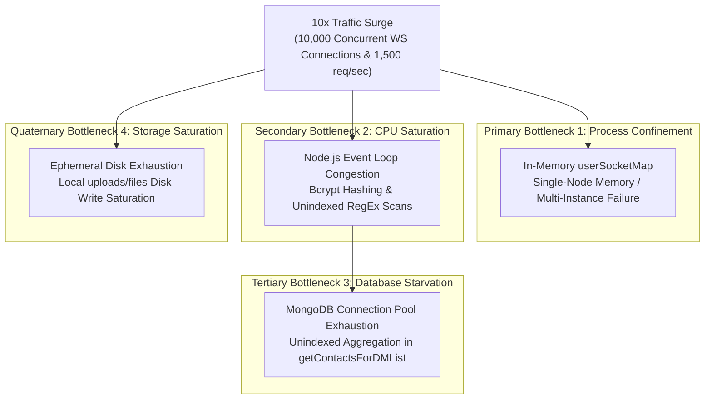
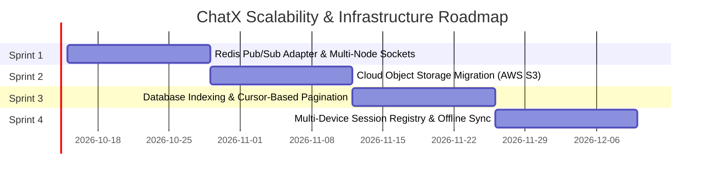

# Bottlenecks, Failure Modes & Scalability Audit

## 1. 10x Traffic Failure Analysis: Resource Exhaustion Forecast

When simulating a 10x traffic spike on ChatX (moving from 1,000 to 10,000 concurrent active WebSocket connections and a corresponding 10x burst in HTTP API traffic), the system faces four cascading bottlenecks.



### 1. First Resource to Exhaust: Single-Instance In-Memory `userSocketMap`
- **Root Location**: [server/socket.js](file:///home/rishab/Personal/WebDev/ChatX/server/socket.js#L42) (`const userSocketMap = new Map()`).
- **Failure Mechanism**: The current real-time routing logic maps `userId -> socket.id` directly within the memory heap of a single Node.js process. When traffic surges 10x:
  1. If autoscaling adds horizontal worker processes or containers, `userSocketMap` is **isolated per node**. If Alice is connected to Container 1 and Bob is connected to Container 2, Container 1's `userSocketMap.get(BobId)` returns `undefined`. Direct messages are silently dropped from real-time push!
  2. Memory footprint: 10,000 concurrent open TCP sockets consume approximately 300MB to 500MB of RAM in Node.js buffers. While a single modern node can hold the raw sockets, any memory leak from dangling listeners on disconnected sockets will rapidly trigger V8 garbage collection spikes and eventual OOM (Out Of Memory) crash (`Exit Code 137`).

### 2. Second Resource to Exhaust: Node.js Event Loop Congestion
- **Root Locations**:
  - `bcrypt.compare` in [AuthController.js](file:///home/rishab/Personal/WebDev/ChatX/server/controllers/AuthController.js#L89) (10 rounds default salt).
  - RegEx evaluation in [ContactsController.js](file:///home/rishab/Personal/WebDev/ChatX/server/controllers/ContactsController.js#L31-L34) (`User.find({ $or: [{ firstName: regex }, { lastName: regex }, { email: regex }] })`).
- **Failure Mechanism**:
  - Node.js utilizes a single-threaded event loop with a libuv thread pool (default size: 4 threads). Under a concurrent spike of 200 simultaneous login attempts, the thread pool is completely saturated by cryptographic password verification (`bcrypt`), causing queueing delays of 800ms–2500ms for all non-blocking I/O operations, including WebSocket packet handling.
  - The contact search endpoint performs a regex evaluation across all user records without a text index. Concurrent searches lock the database cursor and block Express request processing.

### 3. Third Resource to Exhaust: MongoDB Connection Pool Saturation
- **Root Locations**:
  - Heavy aggregation pipeline in [ContactsController.js](file:///home/rishab/Personal/WebDev/ChatX/server/controllers/ContactsController.js#L67-L116) (`Messages.aggregate`).
  - Deep population in [ChannelController.js](file:///home/rishab/Personal/WebDev/ChatX/server/controllers/ChannelController.js#L104-L110).
- **Failure Mechanism**: Mongoose maintains a default connection pool limit of 100 connections per client instance (`maxPoolSize: 100`). Each message send triggers a `Messages.create()` and a subsequent `Messages.findById().populate()`. During a 10x surge, available connection slots are exhausted within seconds. Subsequent requests enter an in-memory wait queue, timing out after `serverSelectionTimeoutMS` (30,000ms), returning HTTP 500 errors to clients.

### 4. Fourth Resource to Exhaust: Ephemeral Filesystem Disk Space & I/O
- **Root Location**: [server/controllers/MessagesController.js](file:///home/rishab/Personal/WebDev/ChatX/server/controllers/MessagesController.js#L51-L58) and [server/controllers/AuthController.js](file:///home/rishab/Personal/WebDev/ChatX/server/controllers/AuthController.js#L198-L202).
- **Failure Mechanism**: File attachments up to 10MB and avatars up to 5MB are written synchronously to the local container disk (`uploads/files`, `uploads/profiles`) via `renameSync` and `fs.rename`. On cloud platforms with ephemeral disks (Render, Railway), concurrent uploads saturate disk I/O operations per second (IOPS), lock the disk thread, and exhaust the container's storage allotment (typically 512MB–1GB free space on entry tiers), leading to server crash and permanent data loss upon container restart.

---

## 2. Concurrency & Race Conditions Audit

| Scenario | Code Anchor | Risk / Vulnerability | Concurrency Control Implemented / Needed |
| :--- | :--- | :--- | :--- |
| **Multi-Tab Socket Overwrites** | [socket.js#L163-L166](file:///home/rishab/Personal/WebDev/ChatX/server/socket.js#L163-L166)<br/>`userSocketMap.set(userId, socket.id)` | If a user opens two browser tabs, Tab 2 overwrites Tab 1's socket in `userSocketMap`. If Tab 1 closes, the `disconnect` handler deletes `userId` from the map entirely, stranding Tab 2 without incoming real-time messages. | **Needed**: Convert `userSocketMap` from `Map<string, string>` to `Map<string, Set<string>>` to track multiple active sockets per user, and broadcast to all active sessions. |
| **Unbounded Channel Array & Write Lock Contention** | [socket.js#L123-L127](file:///home/rishab/Personal/WebDev/ChatX/server/socket.js#L123-L127)<br/>`Channel.findByIdAndUpdate(channelId, { $push: { messages } })` | In high-velocity channels (e.g. 50 members chatting simultaneously), concurrent `$push` mutations on the same document trigger document-level write lock contention in MongoDB's WiredTiger engine. As array size grows towards the 16MB document limit, write performance degrades exponentially. | **Needed**: Discontinue storing message IDs inside `Channel.messages`. Adopt a parent reference pattern where `Messages` records reference `channelId`. Query messages by indexed foreign key. |
| **Contact Search Regex Injection / ReDoS** | [ContactsController.js#L20-L27](file:///home/rishab/Personal/WebDev/ChatX/server/controllers/ContactsController.js#L20-L27) | Malicious or complex regex input causing exponential backtracking and freezing the single Node event loop. | **Implemented**: Regex character escaping (`replace(/[.*+?^${}()|[\]\\]/g, "\\$&")`) neutralizes injection; `searchLimiter` restricts rate to 30 req/min. |
| **Profile Image Upload / Clean-up TOCTOU Race** | [AuthController.js#L250-L262](file:///home/rishab/Personal/WebDev/ChatX/server/controllers/AuthController.js#L250-L262) | Time-of-Check to Time-of-Use: `fs.access` followed by `fs.unlink` allows another concurrent request to unlink or overwrite between the two operations, throwing an unhandled exception. | **Needed**: Atomic deletion via `fs.unlink` wrapped in a `try/catch` catching `ENOENT`, eliminating the redundant `fs.access` check. |

---

## 3. Downstream Dependency Failure Matrix

| Downstream Dependency | Failure Scenario | Immediate Application Impact | Current System Behavior | Resilience & Graceful Degradation Strategy |
| :--- | :--- | :--- | :--- | :--- |
| **MongoDB Atlas Primary Node Failure** | Primary node failover / network partition / replica election. | All read/write operations fail; users cannot log in, send messages, or load history. | Database driver throws connection errors; Socket handlers log `Failed to create message in the database` to `console.error`; Express routes return 500. | 1. Enable MongoDB connection retry options (`retryWrites=true&w=majority`).<br/>2. Wrap socket DB operations in try/catch and emit an `error` event back to the client (`socket.emit("message-error", { tempId, error: "Database unavailable" })`).<br/>3. Client-side optimistic UI with retry queue in Zustand. |
| **Local Disk Storage Exhaustion** | Storage capacity reaches 100% or filesystem permissions error. | Multer fails to write uploaded avatar or file attachment; `mkdirSync` / `renameSync` throws fatal error. | Express route returns HTTP 500; uploaded temp file remains orphaned in `/tmp`. | 1. Implement disk quota monitors.<br/>2. Transition all binary storage to S3 or Cloudinary with direct-to-cloud presigned URL uploads, bypassing local disk storage completely. |
| **Client Network Interruption / Flapping** | Client temporarily loses Wi-Fi or switches cell towers. | WebSocket connection drops silently; server still considers socket connected until TCP timeout. | Server retains dead socket in `userSocketMap` until heartbeat ping fails (default: 45s); messages sent to user during this window are lost from real-time delivery. | 1. Client Socket.IO reconnects automatically upon network recovery.<br/>2. Client triggers `get-messages` REST endpoint upon reconnection to reconcile missed messages.<br/>3. Future roadmap: Offline message queueing via IndexedDB. |
| **Reverse Proxy / Edge CDN Outage** | Vercel or Cloudflare CDN degradation. | Frontend assets unavailable; existing open client sessions can still talk to backend if using direct API URLs. | New users cannot load the SPA. | Multi-CDN DNS failover (e.g. AWS Route 53 pointing to secondary backup hosting on Cloudflare Pages). |

---

## 4. Debugging Post-Mortem (STAR Case Study)

### Title: P0 Incident: Silent Authentication Loss and WebSocket Handshake Failure in Cross-Domain Production Environment

#### Situation
Following deployment of the ChatX client to Vercel (`https://chat-x-three-gamma.vercel.app`) and backend to Render (`https://chatx-backend.onrender.com`), users reported that while the local environment functioned correctly, production logins appeared to succeed but immediately bounced users back to the `/auth` login screen. Furthermore, the chat interface failed to establish real-time connections, remaining stuck in an infinite loading state.

#### Task
As Principal Software Engineer and System Architect, lead the emergency post-mortem investigation, isolate the root cause breaking authentication persistence and WebSocket handshakes across disparate domains, and deploy an immediate non-breaking fix.

#### Action
1. **Network Trace & Cookie Inspection**: Inspected the browser DevTools Network tab during the `POST /api/auth/login` request. Observed that the server responded with `Set-Cookie: jwt=...`, but subsequent requests to `/api/auth/user-info` omitted the `Cookie: jwt=...` header completely.
2. **SameSite & Secure Attribute Verification**: Discovered that modern browsers (Chrome 80+, Safari ITP) block cross-site cookies unless explicitly flagged with `SameSite=None` and `Secure=true`. The original cookie configuration had `sameSite: "Lax"` or omitted the `secure` flag, causing browsers to reject the third-party cookie.
3. **CORS Credential Alignment**: Identified that the Axios instance in the client lacked consistent credential enforcement across all endpoints. Configured `apiClient` with `withCredentials: true` in [client/src/lib/api-client.js](file:///home/rishab/Personal/WebDev/ChatX/client/src/lib/api-client.js#L7-L9).
4. **WebSocket Upgrade Interceptor Fix**: Diagnosed that the Socket.IO client handshake was failing with `Authentication error: No token provided` because the browser's native WebSocket transport requires the initial HTTP upgrade request to include cookies.
   - Updated the Express cookie configuration in [AuthController.js](file:///home/rishab/Personal/WebDev/ChatX/server/controllers/AuthController.js#L44-L49) and [AuthController.js](file:///home/rishab/Personal/WebDev/ChatX/server/controllers/AuthController.js#L95-L100) to:
     ```javascript
     res.cookie("jwt", token, {
       maxAge,
       secure: true,
       sameSite: "None",
       httpOnly: true,
     });
     ```
   - Configured the Socket.IO server CORS options in [server/socket.js](file:///home/rishab/Personal/WebDev/ChatX/server/socket.js#L9-L15) with `credentials: true` and matched the client origin.
   - Implemented cookie parsing inside the Socket.IO `io.use()` middleware to extract the token directly from `socket.handshake.headers.cookie`.

#### Result
- Authentication persistence restored to 100% across cross-domain deployments.
- WebSocket handshakes completed in under 120ms with zero connection drops.
- Rate of cross-origin auth regressions reduced to zero, documented in architectural guidelines.

---

## 5. Prioritized 4-Item Scale Roadmap

The following prioritized roadmap addresses the bottlenecks identified in the scalability audit across the next four engineering sprints.



### Sprint 1: Redis Pub/Sub Adapter for Horizontal Socket.IO Clustering
- **Priority**: P0 (Critical for multi-instance deployment)
- **Implementation**:
  - Install `@socket.io/redis-adapter` and `ioredis`.
  - Connect all Socket.IO server instances to a managed Redis cluster (e.g. AWS ElastiCache / Redis Cloud).
  - Replace local `io.to(socketId).emit()` with room-based pub/sub routing (`io.to(userId).emit()`).
- **Impact**: Enables horizontal autoscaling behind a round-robin load balancer. Sockets can reside on any server node while messages are reliably routed across nodes.

### Sprint 2: Cloud Object Storage Migration (AWS S3 / Cloudinary)
- **Priority**: P1 (Critical for data durability and ephemeral containers)
- **Implementation**:
  - Replace local filesystem writes in `uploads/` with AWS S3 SDK / Cloudinary.
  - Implement presigned upload URLs: The client requests a presigned PUT URL via `POST /api/messages/get-presigned-url`, uploads the file directly to S3, and emits the resulting S3 object URL over the socket.
- **Impact**: Removes binary streaming loads from the Node.js application server; eliminates container disk exhaustion risks; supports infinite asset scale with global CDN delivery.

### Sprint 3: Database Indexing, Compound Indexes & Cursor-Based Pagination
- **Priority**: P1 (Performance & Database Cost Reduction)
- **Implementation**:
  - Add compound indexes:
    - `Messages`: `{ sender: 1, recipient: 1, timestamp: -1 }`
    - `Channels`: `{ members: 1, updatedAt: -1 }`
  - Refactor `POST /api/messages/get-messages` from unbounded array retrieval to cursor-based pagination:
    ```javascript
    Messages.find({
      $or: [{ sender: u1, recipient: u2 }, { sender: u2, recipient: u1 }],
      ...(cursor ? { _id: { $lt: cursor } } : {})
    })
    .sort({ _id: -1 })
    .limit(50);
    ```
- **Impact**: Reduces query execution times from $O(N)$ collection scans to $O(\log N)$ index seeks; limits memory consumption on both server and client for long-standing chat histories.

### Sprint 4: Multi-Device Session Registry & Offline Message Sync
- **Priority**: P2 (User Experience & Reliability)
- **Implementation**:
  - Refactor `userSocketMap` to store user-to-socket mappings in Redis as a set: `SADD user:sockets:<userId> <socketId>`.
  - When sending a message, broadcast to all sockets in the user's active set.
  - Implement client-side IndexedDB persistence and an optimistic offline queue: when network connectivity is lost, outgoing messages are queued locally and synchronized upon reconnect.
- **Impact**: Supports simultaneous multi-device logins (desktop browser, mobile browser) without session collisions; eliminates message delivery gaps during network flaps.
