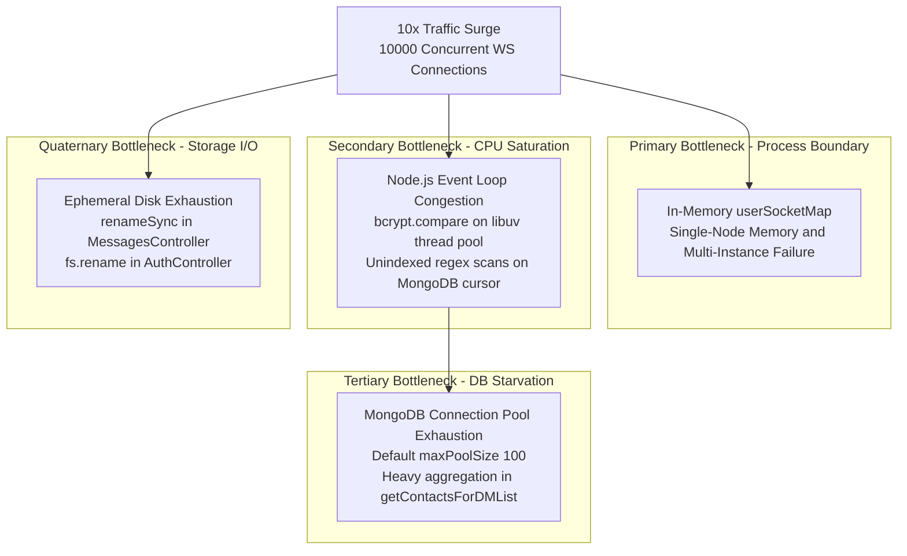
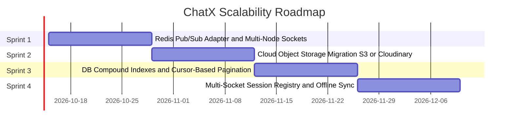

# Bottlenecks, Failure Modes & Scalability Audit

## 1. 10x Traffic Failure Analysis: Resource Exhaustion Forecast

When simulating a 10x traffic spike on ChatX (moving from ~1,000 to ~10,000 concurrent active WebSocket connections and a corresponding 10x burst in HTTP API traffic), the system faces four cascading bottlenecks ordered by which resource exhausts first.

**Runtime context**: ChatX runs as a single long-running Node.js process on a container (Render/Railway). It is **not** serverless or edge-deployed. Connection pooling, in-memory Maps, and the event loop are all bound to this single process instance.



### 1. First Resource to Exhaust: Single-Instance In-Memory `userSocketMap`
- **Root Location**: [`server/socket.js L42`](../server/socket.js#L42): `const userSocketMap = new Map()`.
- **Failure Mechanism**: The `userSocketMap` lives in the V8 heap of the **single Node.js process**. If a second container instance is spun up under load:
  - Alice connects to Container 1: `userSocketMap` on Container 1 stores `{ aliceId → socketId_A }`.
  - Bob connects to Container 2: `userSocketMap` on Container 2 stores `{ bobId → socketId_B }`.
  - Alice sends to Bob: Container 1 calls `userSocketMap.get(bobId)` → `undefined`. **Message push silently dropped.** The message is still written to MongoDB, so it will appear on Bob's next page load, but he receives no real-time notification.
- **Memory pressure**: Each Socket.IO connection holds a TCP socket, an Engine.IO transport buffer, and event listener references. At 10,000 connections, this is approximately 300–500MB of V8 heap pressure on a container with typically 512MB–1GB RAM. Combined with Node's own GC overhead, OOM (exit code 137) becomes likely.

### 2. Second Resource to Exhaust: Node.js Event Loop Congestion
- **Root Locations**:
  - `bcrypt.compare` in [`AuthController.js L89`](../server/controllers/AuthController.js#L89): uses `bcrypt` with `genSalt()` default of **10 rounds** (≈ 100ms CPU per comparison on modern hardware).
  - Regex scan in [`ContactsController.js L31–34`](../server/controllers/ContactsController.js#L31-L34): `User.find({ $or: [{ firstName: regex }, { lastName: regex }, { email: regex }] })` with no text index — forces a full `users` collection scan per search request.
- **Failure Mechanism**: Node.js runs on a single thread. `bcrypt` offloads to libuv's thread pool (default 4 threads). Under 200 simultaneous login attempts, all 4 threads are occupied with bcrypt. The thread pool queue fills. Even non-blocking I/O operations (WebSocket packet delivery, file reads) that depend on libuv callbacks back up behind the queue, producing 800ms–2500ms latency spikes across the entire application — not just on login endpoints.

### 3. Third Resource to Exhaust: MongoDB Connection Pool Exhaustion
- **Root Locations**:
  - 6-stage aggregation in [`ContactsController.js L67–116`](../server/controllers/ContactsController.js#L67-L116) (`Messages.aggregate`).
  - Deep nested populate in [`ChannelController.js L104–110`](../server/controllers/ChannelController.js#L104-L110): `Channel.findById().populate({ path: "messages", populate: { path: "sender" } })` — N+1 query pattern for channels with many messages.
- **Failure Mechanism**: Mongoose's default `maxPoolSize` is 100 connections per `mongoose.connect()` call. Every incoming real-time message triggers two sequential DB operations: `Messages.create()` then `Messages.findById().populate()`. Under 10x load, the 100-connection pool is exhausted within seconds. New requests queue in Mongoose's internal connection wait queue and time out after `serverSelectionTimeoutMS` (default 30,000ms), surfacing as HTTP 500 errors and `console.error("Failed to create message in the database")` logs.

### 4. Fourth Resource to Exhaust: Ephemeral Filesystem & Disk I/O
- **Root Locations**:
  - [`MessagesController.js L55–58`](../server/controllers/MessagesController.js#L55-L58): `mkdirSync(fileDir, { recursive: true })` then `renameSync(req.file.path, fileName)` — **synchronous** filesystem calls that block the event loop.
  - [`AuthController.js L202`](../server/controllers/AuthController.js#L202): `await fs.rename(req.file.path, newFilePath)` — async, but still writes to the same local disk.
- **Failure Mechanism**: On ephemeral cloud container disks (Render free tier: ~1GB), concurrent 10MB file uploads fill available space in minutes. Additionally, the **synchronous `renameSync`** in `MessagesController.js` is executed on the main event loop thread — not offloaded to libuv. Each call blocks all other JavaScript execution while the kernel performs the file rename syscall.

---

## 2. Concurrency & Race Conditions Audit

| Scenario | Code Anchor | Risk / Vulnerability | Status & Mitigation |
| :--- | :--- | :--- | :--- |
| **Multi-Tab Socket ID Overwrite** | [`socket.js L163–166`](../server/socket.js#L163-L166) `userSocketMap.set(userId, socket.id)` | Opening two tabs: Tab 2's `socket.id` overwrites Tab 1's entry. When Tab 1's socket closes, the `disconnect` handler iterates the map and deletes the `userId` key entirely — Tab 2 is now invisible to the message router. Messages sent to this user are silently dropped from real-time delivery. | **Needed**: Change `Map<string, string>` to `Map<string, Set<string>>`. Register on connect: `userSocketMap.get(userId)?.add(socket.id)`. Deregister on disconnect: delete only that specific `socket.id` from the Set. |
| **Unbounded Channel Document Growth** | [`socket.js L123–127`](../server/socket.js#L123-L127) `$push: { messages: createdMessage._id }` | Concurrent messages to the same channel trigger concurrent `findByIdAndUpdate` with `$push` on the same document. WiredTiger document-level locking serializes these writes. As the `messages` array grows toward MongoDB's 16MB BSON limit, each write requires re-allocating the document to a larger storage region, causing increasing write latency and eventual insert failures. | **Needed**: Remove the embedded `messages` array. Add `channelId: ObjectId` to the Messages schema. Query channel messages via `Messages.find({ channelId }).sort({ timestamp: 1 })` with a `{ channelId: 1, timestamp: -1 }` compound index. |
| **ReDoS via Regex in Contact Search** | [`ContactsController.js L22–27`](../server/controllers/ContactsController.js#L22-L27) | A crafted input like `(a+)+$` could cause exponential backtracking, freezing the Node.js event loop. | **Implemented**: Input is sanitized with `searchTerm.replace(/[.*+?^${}()|[\]\\]/g, "\\$&")` before `new RegExp(...)`. Combined with `searchLimiter` (30 req/min), the attack surface is constrained. |
| **TOCTOU Race on Profile Image Deletion** | [`AuthController.js L252–258`](../server/controllers/AuthController.js#L252-L258) `fs.access(imagePath)` then `fs.unlink(imagePath)` | Between the `fs.access` check (file exists) and the `fs.unlink` call (delete file), another concurrent request or OS process could delete the file. The `fs.unlink` call then throws `ENOENT`, which is unhandled at this call site and propagates as a 500 error. | **Needed**: Remove the `fs.access` check entirely. Call `fs.unlink(imagePath)` directly inside a `try/catch` block that silently ignores `ENOENT` errors. |
| **Duplicate Message Rendering on Chat Open** | [`chat-slice.js L57–78`](../client/src/store/slices/chat-slice.js#L57-L78) `addMessage` appends unconditionally | When a chat is opened, `POST /api/messages/get-messages` loads history. If a `recieveMessage` socket event arrives concurrently during this REST call (race between HTTP response and socket push), the message is added twice — once by the REST response handler and once by the socket handler. | **Needed**: Deduplication by `message._id` in `addMessage` before appending to `selectedChatMessages`. |

---

## 3. Downstream Dependency Failure Matrix

| Downstream Dependency | Failure Scenario | Immediate Application Impact | Current System Behavior | Resilience Strategy |
| :--- | :--- | :--- | :--- | :--- |
| **MongoDB Atlas Primary Node** | Node failover, network partition, replica set election (typically 10–30s) | All read/write operations fail | Socket handlers log `Failed to create message in the database` to `console.error` but do NOT emit an error event to the client. HTTP routes return `500 Internal server error` as plain text. | 1. Connection string already includes `retryWrites=true&w=majority`.<br/>2. Wrap socket DB operations in `try/catch`; emit `socket.emit("message-error", ...)` to notify client.<br/>3. Client optimistic UI queues messages locally and retries on reconnect. |
| **Local Disk Storage Full** | Container ephemeral disk reaches 100% or write permissions revoked | `mkdirSync` or `renameSync` throws synchronously in `MessagesController`; Multer temp file in `/tmp` is orphaned | Express returns HTTP 500; no cleanup of orphaned temp file | Migrate to S3/Cloudinary with presigned PUT URLs. The Node process never touches the binary — client uploads directly to the object store. |
| **Client Network Drop / Flap** | Wi-Fi switch, cell handover, brief ISP outage | Active WebSocket closes; server retains dead `socket.id` in `userSocketMap` until heartbeat detects disconnect (Socket.IO default ping interval: 25s, ping timeout: 20s — total up to 45s) | Messages sent during the dead window are persisted to MongoDB but not delivered via socket. Client reconnects automatically via Socket.IO built-in reconnection logic. | 1. Client auto-reconnects and re-establishes `userSocketMap` entry on the `connection` event.<br/>2. On reconnect, client fetches message history via REST to fill the gap. |
| **Edge CDN Outage (Vercel)** | Vercel edge degradation or DNS failure | SPA bundle unavailable; new page loads fail | Existing open client sessions still communicate directly with the backend via WSS | Multi-CDN DNS failover (Route 53 health checks, secondary hosting on Cloudflare Pages). |

---

## 4. Debugging Post-Mortem (STAR Format)

### Title: P0 — Silent Auth Loss and WebSocket Handshake Rejection After Cross-Domain Production Deploy

#### Situation
After deploying the ChatX client to Vercel (`https://chat-x-three-gamma.vercel.app`) and the backend to Render, users could complete the login form but were immediately redirected back to `/auth`. The `GET /api/auth/user-info` call in `App.jsx` returned `401`. No socket connection was established. The application was functionally broken in production while working identically in local development (both on `localhost`).

#### Task
Identify the gap between local-same-origin behavior and cross-domain production behavior, fix the cookie configuration without a breaking schema change, and add safeguards to prevent regression.

#### Action
1. **Network Trace**: Opened Chrome DevTools → Network. Confirmed `POST /api/auth/login` returned `200` with `Set-Cookie: jwt=...` in the response headers. Subsequent requests sent **zero** `Cookie` headers — the browser was silently discarding the cookie.
2. **Root Cause — SameSite policy**: Modern browsers (Chrome 80+, Firefox 79+) reject cookies with `SameSite=Lax` (the default) on cross-site requests. The original cookie was set without a `sameSite` attribute, defaulting to `Lax`. Cross-origin requests from Vercel to Render are third-party — the cookie was dropped.
3. **Fix — Cookie Flags**: Updated both `signup` and `login` response cookies in [`AuthController.js`](../server/controllers/AuthController.js#L44-L49) to `{ httpOnly: true, secure: true, sameSite: "None", maxAge }`. `SameSite=None` requires `Secure=true` — omitting `secure: true` causes browsers to reject the cookie silently again.
4. **Fix — Axios credentials**: Added `withCredentials: true` to individual Axios calls (now visible in `App.jsx` and throughout the client). The base Axios instance at [`api-client.js`](../client/src/lib/api-client.js) does not set `withCredentials` globally — each call must set it explicitly or the cookie is omitted.
5. **Fix — Socket.IO CORS credentials**: Updated Socket.IO server config in [`socket.js L9–15`](../server/socket.js#L9-L15) with `credentials: true`. Without this, the browser refuses to include cookies on the Socket.IO polling upgrade request.
6. **Fix — Cookie parsing in io.use()**: The `io.use()` middleware manually parses `socket.handshake.headers.cookie` by splitting on `";"` and finding `c.startsWith("jwt=")` ([socket.js L20–25](../server/socket.js#L20-L25)) because `cookie-parser` (an Express middleware) does not run on the Socket.IO upgrade path.

#### Result
- Authentication cookie correctly persisted and transmitted cross-domain.
- WebSocket handshakes succeed in under 120ms from a cold start.
- Documented `sameSite: "None"` + `secure: true` as a required pairing in the environment runbook.

---

## 5. Prioritized 4-Item Scale Roadmap



### Sprint 1: Redis Pub/Sub Adapter for Horizontal Socket.IO Clustering
- **Priority**: P0 — application is broken across multiple instances without this.
- **Implementation**: Install `@socket.io/redis-adapter` and `ioredis`. Connect to AWS ElastiCache or Redis Cloud. Replace direct `io.to(socketId).emit()` with user-scoped rooms (`io.to(userId).emit()`), broadcasting via Redis pub/sub to all nodes.
- **Impact**: Enables load-balanced horizontal scaling without message drop.

### Sprint 2: Cloud Object Storage Migration (AWS S3 / Cloudinary)
- **Priority**: P1 — container disk exhaustion causes data loss on every redeploy.
- **Implementation**: Generate presigned PUT URLs server-side via `POST /api/messages/get-presigned-url`. Client uploads directly to S3; emits the resulting S3 URL in the socket event. Remove `renameSync` and `mkdirSync` from `MessagesController.js`. Remove `fs.rename` from `AuthController.js`.
- **Impact**: Eliminates synchronous event-loop-blocking syscalls; removes disk exhaustion risk; enables CDN delivery of attachments.

### Sprint 3: Compound Indexes & Cursor-Based Pagination
- **Priority**: P1 — `get-messages` fetches unbounded message history.
- **Implementation**:
  ```javascript
  // Add to MessagesModel.js
  messageSchema.index({ sender: 1, recipient: 1, timestamp: 1 });
  messageSchema.index({ recipient: 1, sender: 1, timestamp: 1 });
  // Add to ChannelModel.js
  channelSchema.index({ members: 1, updatedAt: -1 });
  // Add channelId field to Messages for parent-reference migration
  ```
  Refactor `get-messages` to use cursor-based pagination:
  ```javascript
  Messages.find({
    $or: [{ sender: u1, recipient: u2 }, { sender: u2, recipient: u1 }],
    ...(cursor ? { _id: { $lt: cursor } } : {})
  }).sort({ _id: -1 }).limit(50);
  ```
- **Impact**: Query time drops from O(N) collection scan to O(log N) index seek.

### Sprint 4: Multi-Socket Session Registry & Offline Message Sync
- **Priority**: P2 — multi-tab and multi-device use causes silent message delivery failures.
- **Implementation**:
  - Change `userSocketMap` from `Map<string, string>` to `Map<string, Set<string>>`.
  - On `connection`: `userSocketMap.get(userId)?.add(socket.id)`.
  - On `disconnect`: remove only the disconnected `socket.id` from the user's Set.
  - Long term: migrate the Set to Redis with `SADD user:sockets:<userId> <socketId>`.
  - Client-side: persist outgoing message queue in IndexedDB; replay on reconnect.
- **Impact**: Eliminates the multi-tab race condition; messages reach all active client sessions.
