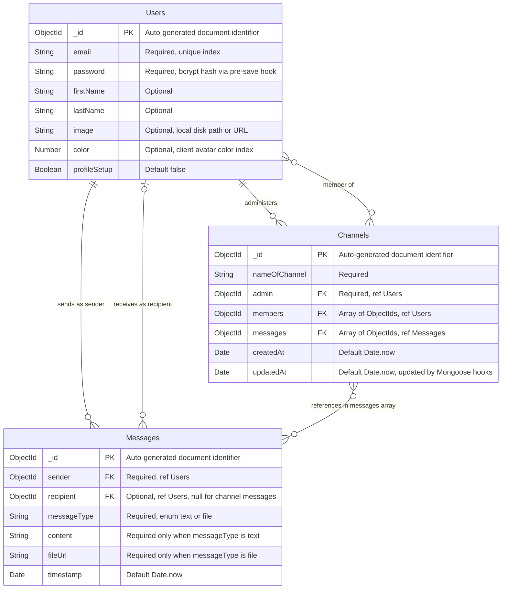

# Database Schema & Entity Relationships

## 1. Entity Relationship Diagram (ERD)

The following ER diagram reflects the actual Mongoose model definitions across the three MongoDB collections in ChatX.

> **Cardinality note**: A `Messages` document is linked to a `Channels` document indirectly — the `Channel.messages` array holds `ObjectId` references to `Messages` documents. A `Messages` document does not carry a `channelId` back-reference (parent-reference pattern is not implemented yet). The ERD reflects the actual current schema, not the desired future state.



---

## 2. Comprehensive Data Dictionary

### Collection: `users`
**Mongoose Registration**: `mongoose.model("Users", userSchema)` → collection `users` (Mongoose lowercases and pluralizes)
**Model Definition**: [UserModel.js](../server/models/UserModel.js)

| Field Name | BSON Type | Nullable | Default | Constraints & Validations | Notes |
| :--- | :--- | :--- | :--- | :--- | :--- |
| `_id` | `ObjectId` | No | Auto | Primary Key | Immutable. |
| `email` | `String` | No | — | `required: [true, "Email is required"]`, `unique: true` | Unique B-Tree index auto-created by Mongoose. Used as the `$lookup` join key from `messages` collection in `getContactsForDMList`. |
| `password` | `String` | No | — | `required: [true, "Password is required"]` | Bcrypt hash. Generated in `pre("save")` hook via `genSalt()` (10 rounds) + `hash()`. Minimum 8-char plaintext enforced in [`AuthController.js L28–30`](../server/controllers/AuthController.js#L28-L30). |
| `firstName` | `String` | Yes | `undefined` | `required: false` | Not set on signup. Set by `POST /api/auth/update-profile`. Used in regex search. |
| `lastName` | `String` | Yes | `undefined` | `required: false` | Not set on signup. Set by `POST /api/auth/update-profile`. |
| `image` | `String` | Yes | `undefined` | `required: false` | Relative disk path (e.g. `uploads/profiles/1727931200000.png`). Returned as-is by API — client prefixes `VITE_SERVER_URL` to construct the full URL. |
| `color` | `Number` | Yes | `undefined` | `required: false` | Integer. Client maps index to a Tailwind avatar background color. No range validation in schema. |
| `profileSetup` | `Boolean` | No | `false` | — | Set to `true` when `POST /api/auth/update-profile` succeeds. Client `App.jsx` and route guards use this to redirect incomplete profiles to `/profile`. |

**On-Delete Behavior**: No cascade. Mongoose has no equivalent to SQL `ON DELETE CASCADE`. Deleting a user document leaves orphaned `Messages` with `sender`/`recipient` pointing to a non-existent `_id`. These resolve to `null` during `.populate()`. Application-layer cleanup must be implemented manually.

---

### Collection: `messages`
**Mongoose Registration**: `mongoose.model("Messages", messageSchema)` → collection `messages`
**Model Definition**: [MessagesModel.js](../server/models/MessagesModel.js)

| Field Name | BSON Type | Nullable | Default | Constraints & Validations | Notes |
| :--- | :--- | :--- | :--- | :--- | :--- |
| `_id` | `ObjectId` | No | Auto | Primary Key | Used as the reference stored in `Channel.messages` array. |
| `sender` | `ObjectId` | No | — | `ref: "Users"`, `required: true` | Always overwritten server-side to `socket.userId` in socket handlers — client-supplied sender value is ignored. |
| `recipient` | `ObjectId` | Yes | — | `ref: "Users"`, `required: false` | `null` for channel messages (set explicitly in `socket.js L107–114`). Present for direct messages. |
| `messageType` | `String` | No | — | `required: true`, `enum: ["text", "file"]` | Acts as a discriminator for conditional field validation. |
| `content` | `String` | Yes | — | `required: function() { return this.messageType === "text"; }` | Dynamic validator. Required only for `text` messages. |
| `fileUrl` | `String` | Yes | — | `required: function() { return this.messageType === "file"; }` | Relative disk path returned by `POST /api/messages/upload-file`. Client prefixes the server URL. |
| `timestamp` | `Date` | No | `Date.now` | `default: Date.now` | Used for ordering in `find().sort({ timestamp: 1 })` and as the sort key in the contacts aggregation pipeline. |

**On-Delete Behavior**: No cascade. `Channel.messages` array retains the `ObjectId` even after the `Messages` document is deleted. Stale references must be cleaned manually.

---

### Collection: `channels`
**Mongoose Registration**: `mongoose.model("Channels", channelSchema)` → collection `channels`
**Model Definition**: [ChannelModel.js](../server/models/ChannelModel.js)

| Field Name | BSON Type | Nullable | Default | Constraints & Validations | Notes |
| :--- | :--- | :--- | :--- | :--- | :--- |
| `_id` | `ObjectId` | No | Auto | Primary Key | Used in socket event `channelId` field to route channel messages. |
| `nameOfChannel` | `String` | No | — | `required: true` | No uniqueness constraint — duplicate channel names are allowed. |
| `admin` | `ObjectId` | No | — | `ref: "Users"`, `required: true` | Set to `req.userId` at channel creation in [`ChannelController.js L29`](../server/controllers/ChannelController.js#L29). The admin also receives channel messages via socket broadcast in addition to the `members` array. |
| `members` | `Array<ObjectId>` | No | `[]` | `ref: "Users"`, `required: true` per element | Validated at creation: `User.find({ _id: { $in: members } })` must return same count as input. Does **not** include the admin. Admin is tracked separately and broadcast separately in `socket.js L152–156`. |
| `messages` | `Array<ObjectId>` | No | `[]` | `ref: "Messages"`, `required: false` | Append-only via `$push` on every channel message. Grows unboundedly — a known scaling limitation (see docs/3-scale-and-limits.md). |
| `createdAt` | `Date` | No | `Date.now` | — | Set at document creation. Not updated by hooks. |
| `updatedAt` | `Date` | No | `Date.now` | Updated by `pre("save")` and `pre("findOneAndUpdate")` hooks | Used as sort key in `getUserChannels`: `Channel.find(...).sort({ updatedAt: -1 })`. |

**Important**: The `admin` is **not** included in the `members` array. When broadcasting channel messages in [`socket.js L136–157`](../server/socket.js#L136-L157), the code iterates `channel.members` and then separately emits to `channel.admin`. Any authorization check that only checks `channel.members.includes(userId)` will incorrectly reject the admin.

---

## 3. Indexing Strategy & Performance Justifications

### Currently Active Indexes (Auto-Created by Mongoose/MongoDB)

| Collection | Field | Index Type | Created By | Justification |
| :--- | :--- | :--- | :--- | :--- |
| `users` | `_id` | Unique B-Tree | MongoDB native | All `User.findById(req.userId)` calls in auth middleware and controllers. |
| `users` | `email` | Unique B-Tree | `unique: true` in schema | `User.findOne({ email })` in `login` and `signup`. Without this index, each login is an O(N) collection scan. |
| `messages` | `_id` | Unique B-Tree | MongoDB native | `Messages.findById(createdMessage._id).populate(...)` after every message create. |
| `channels` | `_id` | Unique B-Tree | MongoDB native | `Channel.findById(channelId)` in `getChannelMessages` and socket handlers. |

### Recommended Secondary Indexes (Not Yet Implemented)

#### A. Direct Message History Retrieval
```javascript
// MessagesModel.js
messageSchema.index({ sender: 1, recipient: 1, timestamp: 1 });
messageSchema.index({ recipient: 1, sender: 1, timestamp: 1 });
```
**Query served** ([MessagesController.js L16–21](../server/controllers/MessagesController.js#L16-L21)):
```javascript
Messages.find({
  $or: [
    { sender: user1, recipient: user2 },
    { sender: user2, recipient: user1 },
  ],
}).sort({ timestamp: 1 });
```
**Justification**: The `$or` with two compound predicates requires two index intersection operations. Without an index, MongoDB performs a full collection scan across all messages for all users. With separate compound indexes on `(sender, recipient, timestamp)` and `(recipient, sender, timestamp)`, each branch of the `$or` can use an index range scan, and the sort on `timestamp` is covered by the index — no in-memory sort buffer required.

#### B. DM Contact Recency Aggregation
```javascript
messageSchema.index({ sender: 1, timestamp: -1 });
messageSchema.index({ recipient: 1, timestamp: -1 });
```
**Query served** ([ContactsController.js L67–78](../server/controllers/ContactsController.js#L67-L78)):
```javascript
Messages.aggregate([
  { $match: { $or: [{ sender: userId }, { recipient: userId }] } },
  { $sort: { timestamp: -1 } },
  ...
]);
```
**Justification**: The `$sort` stage on `timestamp` is the first costly operation after `$match`. With an index on `{ sender: 1, timestamp: -1 }`, MongoDB can produce pre-sorted results for the sender branch without an in-memory sort. Without this, the aggregation pipeline performs a `SORT` on the full matched result set in working memory (capped at 100MB before spilling to disk).

#### C. Channel Membership Lookups
```javascript
// ChannelModel.js
channelSchema.index({ members: 1 });
channelSchema.index({ admin: 1 });
// Compound for sorted listing:
channelSchema.index({ admin: 1, updatedAt: -1 });
channelSchema.index({ members: 1, updatedAt: -1 });
```
**Query served** ([ChannelController.js L58–60](../server/controllers/ChannelController.js#L58-L60)):
```javascript
Channel.find({
  $or: [{ admin: userId }, { members: userId }]
}).sort({ updatedAt: -1 });
```
**Justification**: `members` is an array — an index on it creates a MongoDB **multikey index**, one index entry per array element. This allows `members: userId` to be resolved as a point lookup rather than a scan. Without this, every sidebar channel list load scans the entire `channels` collection.

#### D. Contact Search Full-Text Index (Future)
```javascript
userSchema.index({ firstName: "text", lastName: "text", email: "text" });
```
**Justification**: The current search uses `new RegExp(sanitizedSearchTerm, "i")` — case-insensitive regex. MongoDB cannot use a standard B-Tree index for unanchored or case-insensitive regex matches. A text index tokenizes field values and supports fast prefix and full-word lookups. Note: a collection can have only **one text index** — all three fields must be combined into a single `text` index specification.
