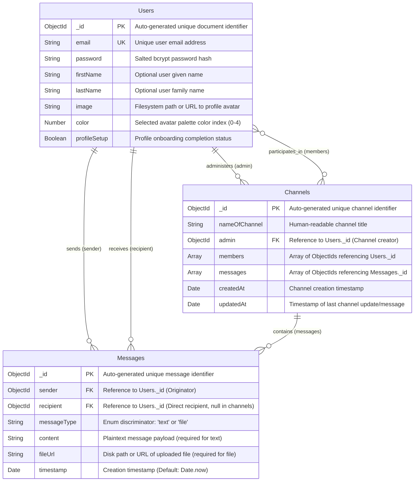
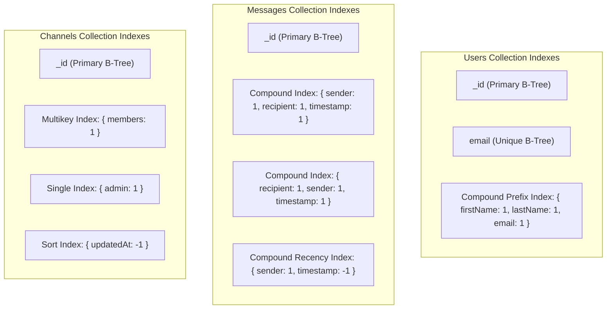

# Database Schema & Entity Relationships

## 1. Entity Relationship Diagram (ERD)

The following Mermaid ER diagram illustrates the logical and physical document schema for ChatX across MongoDB collections, including primary keys, foreign key references, and exact cardinalities.



---

## 2. Comprehensive Data Dictionary

### Collection: `Users`
**Physical Collection Name**: `users`  
**Model Definition**: [UserModel.js](file:///home/rishab/Personal/WebDev/ChatX/server/models/UserModel.js)  
**Description**: Stores core user authentication credentials, identity information, profile visual personalization, and onboarding flags.

| Field Name | BSON / JS Type | Nullable | Default | Constraints & Validations | Description & Cascade Rules |
| :--- | :--- | :--- | :--- | :--- | :--- |
| `_id` | `ObjectId` | No | Auto | Primary Key (MongoDB native) | Immutable document identifier. |
| `email` | `String` | No | None | `required: [true, "Email is required"]`, `unique: true` | Primary credential. Enforced via unique B-Tree index. |
| `password` | `String` | No | None | `required: [true, "Password is required"]`, min-length 8 enforced in controller | Salted BCrypt hash (generated via Mongoose `pre("save")` hook). Plaintext is never stored. |
| `firstName` | `String` | Yes | `null` | Optional | User's first name. Filtered in directory and contact searches. |
| `lastName` | `String` | Yes | `null` | Optional | User's family name. Filtered in directory and contact searches. |
| `image` | `String` | Yes | `null` | Optional | Relative local disk path (e.g. `uploads/profiles/1727931200000.png`) or cloud URL. |
| `color` | `Number` | Yes | `null` | Optional | Integer index mapped to Tailwind color themes on client UI. |
| `profileSetup`| `Boolean` | No | `false` | None | Boolean gate used by client routing guards to redirect users to `/profile` on first login. |

**Cascade & Integrity Rules**:
- When a `User` is deleted:
  - Direct messages sent/received by the user are retained in the `Messages` collection for audit integrity; sender/recipient fields will resolve to `null` on populate.
  - Channels administered by the user require an administrative transfer or deletion cascade handled in the controller layer.
  - The user's avatar file on disk must be unlinked via `fs.unlink`.

---

### Collection: `Messages`
**Physical Collection Name**: `messages`  
**Model Definition**: [MessagesModel.js](file:///home/rishab/Personal/WebDev/ChatX/server/models/MessagesModel.js)  
**Description**: Append-only log of one-to-one direct messages and channel messages.

| Field Name | BSON / JS Type | Nullable | Default | Constraints & Validations | Description & Cascade Rules |
| :--- | :--- | :--- | :--- | :--- | :--- |
| `_id` | `ObjectId` | No | Auto | Primary Key | Immutable message identifier. |
| `sender` | `ObjectId` | No | None | `ref: "Users"`, `required: true` | Foreign key referencing the originator user in `users`. |
| `recipient` | `ObjectId` | Yes | `null` | `ref: "Users"`, `required: false` | Foreign key referencing recipient user in `users`. Set to `null` for channel messages. |
| `messageType`| `String` | No | None | `enum: ["text", "file"]`, `required: true` | Type discriminator for conditional payload validation. |
| `content` | `String` | Yes | `null` | Required if `messageType === "text"` | Plaintext message body. Validated via dynamic Mongoose validation function. |
| `fileUrl` | `String` | Yes | `null` | Required if `messageType === "file"` | Path or URL to uploaded asset. Validated via dynamic Mongoose validation function. |
| `timestamp` | `Date` | No | `Date.now`| `default: Date.now` | Millisecond-precision timestamp used for message ordering and contact recency aggregation. |

**Cascade & Integrity Rules**:
- Direct messages reference both `sender` and `recipient`.
- Channel messages reference only `sender`; `recipient` is explicitly set to `null`.
- If an attachment message is purged, the associated binary file at `fileUrl` must be cleaned from disk.

---

### Collection: `Channels`
**Physical Collection Name**: `channels`  
**Model Definition**: [ChannelModel.js](file:///home/rishab/Personal/WebDev/ChatX/server/models/ChannelModel.js)  
**Description**: Represents collaborative multi-user group chat rooms.

| Field Name | BSON / JS Type | Nullable | Default | Constraints & Validations | Description & Cascade Rules |
| :--- | :--- | :--- | :--- | :--- | :--- |
| `_id` | `ObjectId` | No | Auto | Primary Key | Unique channel identifier. |
| `nameOfChannel`| `String` | No | None | `required: true` | Display name of the channel. |
| `admin` | `ObjectId` | No | None | `ref: "Users"`, `required: true` | Creator and administrator user ID. Holds elevated channel permissions. |
| `members` | `Array<ObjectId>` | No | `[]` | `ref: "Users"`, `required: true` | Array of user `ObjectId`s authorized to participate in this channel. |
| `messages` | `Array<ObjectId>` | No | `[]` | `ref: "Messages"`, `required: false` | Array of message `ObjectId`s belonging to this channel. |
| `createdAt` | `Date` | No | `Date.now`| Immutable timestamp | Timestamp of channel initialization. |
| `updatedAt` | `Date` | No | `Date.now`| Hook updated | Managed via Mongoose `pre("save")` and `pre("findOneAndUpdate")` hooks to reflect last message activity. |

**Cascade & Integrity Rules**:
- When a channel is deleted:
  - All associated `Messages` referenced in `messages` should be batch-deleted via `Messages.deleteMany({ _id: { $in: channel.messages } })`.
  - Binary files referenced in those messages should be cleaned up asynchronously.

---

## 3. Indexing Strategy & Performance Justifications



### 1. Existing Production Indexes
- **`Users._id`** (Unique B-Tree, Auto): Serves as the primary key. Guarantees $O(1)$ point lookups by `userId` during JWT validation and user info queries.
- **`Users.email`** (Unique B-Tree): Automatically created via `unique: true` in [UserModel.js](file:///home/rishab/Personal/WebDev/ChatX/server/models/UserModel.js#L9). Prevents duplicate registrations and accelerates `User.findOne({ email })` lookups to $<2\text{ms}$.
- **`Messages._id`** (Unique B-Tree, Auto): Accelerates individual message lookups following creation.
- **`Channels._id`** (Unique B-Tree, Auto): Accelerates channel point lookups during message delivery and permission verification.

### 2. High-Impact Secondary & Compound Indexes (Recommended for Scaling)

#### A. Direct Message Retrieval Optimization
- **Index Specification**:
  ```javascript
  // Direct Message query index
  messageSchema.index({ sender: 1, recipient: 1, timestamp: 1 });
  messageSchema.index({ recipient: 1, sender: 1, timestamp: 1 });
  ```
- **Query Benefited**: [MessagesController.js#L16-L21](file:///home/rishab/Personal/WebDev/ChatX/server/controllers/MessagesController.js#L16-L21):
  ```javascript
  Messages.find({
    $or: [
      { sender: user1, recipient: user2 },
      { sender: user2, recipient: user1 },
    ],
  }).sort({ timestamp: 1 });
  ```
- **Justification**: Without this compound index, the `$or` query forces MongoDB to perform a full collection scan across all historical messages in the system. The compound index provides index-covered sorting on `timestamp`, eliminating memory sort buffers (`Sort operation used more than 33554432 bytes of RAM`).

#### B. Direct Message Contact List Recency Aggregation
- **Index Specification**:
  ```javascript
  messageSchema.index({ sender: 1, timestamp: -1 });
  messageSchema.index({ recipient: 1, timestamp: -1 });
  ```
- **Query Benefited**: [ContactsController.js#L67-L78](file:///home/rishab/Personal/WebDev/ChatX/server/controllers/ContactsController.js#L67-L78):
  ```javascript
  Messages.aggregate([
    { $match: { $or: [{ sender: userId }, { recipient: userId }] } },
    { $sort: { timestamp: -1 } },
    ...
  ]);
  ```
- **Justification**: The pipeline matches messages where the user is either sender or recipient and immediately executes a descending sort on `timestamp`. This index allows the MongoDB query planner to execute an index scan without pulling millions of unrelated records into working memory.

#### C. User Channel Membership Lookups
- **Index Specification**:
  ```javascript
  channelSchema.index({ members: 1 });
  channelSchema.index({ admin: 1 });
  channelSchema.index({ updatedAt: -1 });
  ```
- **Query Benefited**: [ChannelController.js#L58-L60](file:///home/rishab/Personal/WebDev/ChatX/server/controllers/ChannelController.js#L58-L60):
  ```javascript
  Channel.find({
    $or: [{ admin: userId }, { members: userId }]
  }).sort({ updatedAt: -1 });
  ```
- **Justification**: `members` is an array of `ObjectId`s. Creating an index on `members` produces a **multikey index**, allowing MongoDB to locate all channels a user belongs to in logarithmic time. Coupling this with `{ updatedAt: -1 }` guarantees zero-cost sorting when ordering the sidebar channel list.

#### D. Contact Search Directory Indexing
- **Index Specification**:
  ```javascript
  userSchema.index({ firstName: "text", lastName: "text", email: "text" });
  ```
- **Query Benefited**: [ContactsController.js#L31-L34](file:///home/rishab/Personal/WebDev/ChatX/server/controllers/ContactsController.js#L31-L34):
  ```javascript
  User.find({
    $and: [{ _id: { $ne: req.userId } }],
    $or: [{ firstName: regex }, { lastName: regex }, { email: regex }],
  });
  ```
- **Justification**: The current implementation uses case-insensitive regular expressions (`new RegExp(sanitizedSearchTerm, "i")`). Case-insensitive regex searches cannot utilize standard B-Tree indexes unless prefix-anchored (`^`). A text index allows full-text token search with scoring, reducing query execution times on large user bases from seconds to milliseconds.
