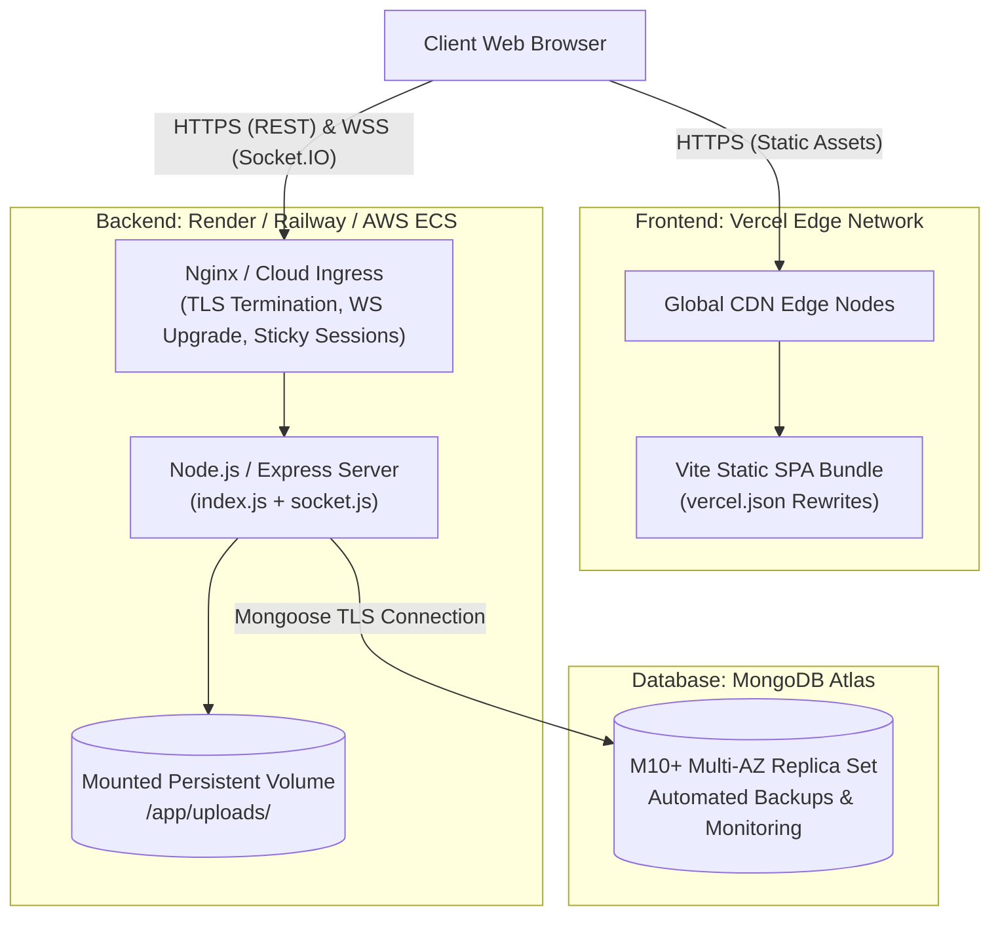

# Environment, Configuration & Deployment Runbook

## 1. Environment Variable Matrix

The application's runtime configuration is managed through decoupled environment variables for both backend and frontend tiers, based on [server/.env.example](file:///home/rishab/Personal/WebDev/ChatX/server/.env.example) and [client/.env.example](file:///home/rishab/Personal/WebDev/ChatX/client/.env.example).

### Backend Server (`/server/.env`)
Validated at startup in [server/index.js](file:///home/rishab/Personal/WebDev/ChatX/server/index.js#L18-L24). If any required variable is omitted, the process exits immediately with code `1`.

| Variable Name | Environment | Purpose / Description | Safe Dummy Value | Is Secret? | Production Guidelines |
| :--- | :--- | :--- | :--- | :--- | :--- |
| `PORT` | Server | Network port on which the Express HTTP server and Socket.IO engine bind. | `3000` | No | In cloud environments (Render, Railway, Heroku), this is injected dynamically by the PaaS via `$PORT`. |
| `JWT_KEY` | Server | Secret cryptographic key used to sign and verify HMAC-SHA256 stateless session tokens. | `"dev_super_secret_jwt_key_min_32_chars_12345"` | **YES** | Must be generated with high entropy (e.g. `openssl rand -base64 32`). Must never be committed to source control. |
| `ORIGIN` | Server | Allowed client origin for CORS whitelisting and Socket.IO handshake origin checks. | `"http://localhost:5173"` | No | Set to the exact production frontend URL (e.g. `"https://chat-x-three-gamma.vercel.app"`). Do not include trailing slashes. |
| `DB_URL` | Server | MongoDB Atlas or local MongoDB connection URI with credentials and replica set parameters. | `"mongodb://127.0.0.1:27017/chatx"` | **YES** | In production, use MongoDB Atlas connection string with TLS and retry parameters: `mongodb+srv://<user>:<pwd>@cluster0.mongodb.net/chatx?retryWrites=true&w=majority`. |

### Frontend Client (`/client/.env`)
Bundled at compile-time via Vite. All variables intended for client consumption must carry the `VITE_` prefix.

| Variable Name | Environment | Purpose / Description | Safe Dummy Value | Is Secret? | Production Guidelines |
| :--- | :--- | :--- | :--- | :--- | :--- |
| `VITE_SERVER_URL` | Client | Backend API and Socket.IO gateway base URL. Configures Axios `baseURL` and Socket.IO `io()` connection. | `"http://localhost:3000"` | No | Must point to the production backend URL (e.g. `"https://chatx-backend.onrender.com"`). |

---

## 2. Clean-Machine Setup Runbook

Follow these exact CLI instructions to configure, initialize, and execute the entire ChatX platform on a fresh development machine.

### Prerequisites
- **Node.js**: v18.x or v20.x LTS ([Download](https://nodejs.org/))
- **npm**: v9.x or v10.x
- **Git**: Installed and authenticated
- **MongoDB**: Local MongoDB instance (`mongod`) running on port `27017` OR a free MongoDB Atlas connection string.

### Step-by-Step CLI Execution

```bash
# 1. Clone the repository
git clone https://github.com/rishab2211/ChatX.git
cd ChatX

# ---------------------------------------------------------
# 2. Configure & Initialize Backend Server
# ---------------------------------------------------------
cd server

# Install backend dependencies
npm install

# Generate local environment configuration from template
cat << 'EOF' > .env
PORT=3000
JWT_KEY="development_jwt_secret_key_at_least_32_chars_long!"
ORIGIN="http://localhost:5173"
DB_URL="mongodb://127.0.0.1:27017/chatx"
EOF

# Ensure required local upload directories exist
mkdir -p uploads/profiles uploads/files

# Verify MongoDB connectivity and boot server in development mode
# Note: Nodemon monitors index.js, controllers, and models for hot reloads
npm run dev

# ---------------------------------------------------------
# 3. Configure & Initialize Frontend Client (in a separate terminal)
# ---------------------------------------------------------
cd ../client

# Install frontend dependencies
npm install

# Generate local environment configuration from template
cat << 'EOF' > .env
VITE_SERVER_URL="http://localhost:3000"
EOF

# Boot Vite development server with Hot Module Replacement (HMR)
npm run dev
```

### Verification & Health Check
Open a third terminal and execute the following sanity tests:

```bash
# 1. Test Backend Liveness Endpoint
curl -i http://localhost:3000/health

# Expected Output:
# HTTP/1.1 200 OK
# Content-Type: application/json; charset=utf-8
# {"status":"ok","timestamp":"2026-10-03T04:57:19.000Z"}

# 2. Test Frontend Availability
curl -i http://localhost:5173/

# Expected Output:
# HTTP/1.1 200 OK
# (Vite HTML entry point returned)
```

---

## 3. Production Hosting Architecture

ChatX is architected for distributed cloud deployment, separating static client delivery from compute and persistence.



### 1. Frontend: Vercel Hosting
- **Repository Root**: `/client`
- **Build Command**: `npm run build`
- **Output Directory**: `dist`
- **SPA Routing Rewrite**: Configured in [client/vercel.json](file:///home/rishab/Personal/WebDev/ChatX/client/vercel.json) to route all paths to `index.html`:
  ```json
  {
    "rewrites": [
      {
        "source": "/(.*)",
        "destination": "/"
      }
    ]
  }
  ```
- **Environment Variables**: Configure `VITE_SERVER_URL` in the Vercel Project Settings to match the backend production URL.

### 2. Backend: Render / Railway / AWS ECS
- **Repository Root**: `/server`
- **Build Command**: `npm install`
- **Start Command**: `npm start` (`node index.js`)
- **Persistent Volume Mount**: For single-instance container deployments, mount a persistent volume at `/app/uploads` to preserve avatars and chat files across container redeployments.

### 3. Reverse Proxy & WebSocket Configuration (Nginx Reference)
When deploying behind a self-hosted Nginx or cloud reverse proxy, the following configuration ensures proper HTTP/1.1 WebSocket upgrading and cookie propagation:

```nginx
upstream chatx_backend {
    # Hash on client IP for sticky sessions required by Socket.IO long-polling fallback
    ip_hash;
    server 127.0.0.1:3000;
}

server {
    listen 443 ssl http2;
    server_name api.chatx.com;

    ssl_certificate /etc/letsencrypt/live/api.chatx.com/fullchain.pem;
    ssl_certificate_key /etc/letsencrypt/live/api.chatx.com/privkey.pem;
    ssl_protocols TLSv1.2 TLSv1.3;

    # Set maximum upload size matching Multer limits
    client_max_body_size 15M;

    # REST API & Static Uploads Proxy
    location / {
        proxy_pass http://chatx_backend;
        proxy_http_version 1.1;
        proxy_set_header Host $host;
        proxy_set_header X-Real-IP $remote_addr;
        proxy_set_header X-Forwarded-For $proxy_add_x_forwarded_for;
        proxy_set_header X-Forwarded-Proto $scheme;
        proxy_set_header Cookie $http_cookie;
    }

    # WebSocket Upgrade Proxy for Socket.IO
    location /socket.io/ {
        proxy_pass http://chatx_backend/socket.io/;
        proxy_http_version 1.1;
        proxy_set_header Upgrade $http_upgrade;
        proxy_set_header Connection "upgrade";
        proxy_set_header Host $host;
        proxy_set_header X-Real-IP $remote_addr;
        proxy_set_header X-Forwarded-For $proxy_add_x_forwarded_for;
        proxy_set_header X-Forwarded-Proto $scheme;
        
        # Disable proxy buffering for sub-millisecond event streaming
        proxy_buffering off;
        proxy_read_timeout 86400s;
        proxy_send_timeout 86400s;
    }
}
```

---

## 4. Health Check Route Specifications

To enable orchestration platforms (Kubernetes, AWS ECS, Docker Swarm, Render) to perform automated container restarts and traffic routing, ChatX specifies distinct liveness and readiness probes.

### 1. Existing Liveness Probe: `GET /health`
- **Location**: [server/index.js](file:///home/rishab/Personal/WebDev/ChatX/server/index.js#L78-L80)
- **Purpose**: Verifies that the Node.js process is executing and capable of responding to HTTP requests.
- **Response**:
  ```json
  // HTTP 200 OK
  {
    "status": "ok",
    "timestamp": "2026-10-03T04:57:19.000Z"
  }
  ```

### 2. Readiness Probe Specification: `GET /health/ready`
- **Purpose**: Verifies downstream dependencies before routing client traffic to the node. Specifically checks that Mongoose has established an active connection to MongoDB Atlas.
- **Specification for Implementation in `server/index.js`**:
  ```javascript
  app.get("/health/ready", (req, res) => {
    // 0 = disconnected, 1 = connected, 2 = connecting, 3 = disconnecting
    const dbState = mongoose.connection.readyState;
    if (dbState === 1) {
      return res.status(200).json({
        status: "ready",
        database: "connected",
        timestamp: new Date().toISOString()
      });
    } else {
      return res.status(503).json({
        status: "not_ready",
        database: "disconnected",
        stateCode: dbState,
        timestamp: new Date().toISOString()
      });
    }
  });
  ```
- **Orchestrator Behavior**:
  - `503 Service Unavailable`: Load balancer temporarily removes the container from the active routing pool without killing the process, waiting for replica set re-connection.
  - `200 OK`: Container added to active ingress traffic rotation.
